# Guía de Instalación y Configuración - Proyecto 1

## Instalación de KVM para Virtualización

### 1. Verificar si tu CPU soporta virtualización
Ejecuta el siguiente comando. Debe mostrar un número mayor a 0 y el archivo `/proc/cpuinfo` debe contener `vmx` (Intel) o `svm` (AMD).

```bash
egrep -c '(vmx|svm)' /proc/cpuinfo
```

<div align="center">
  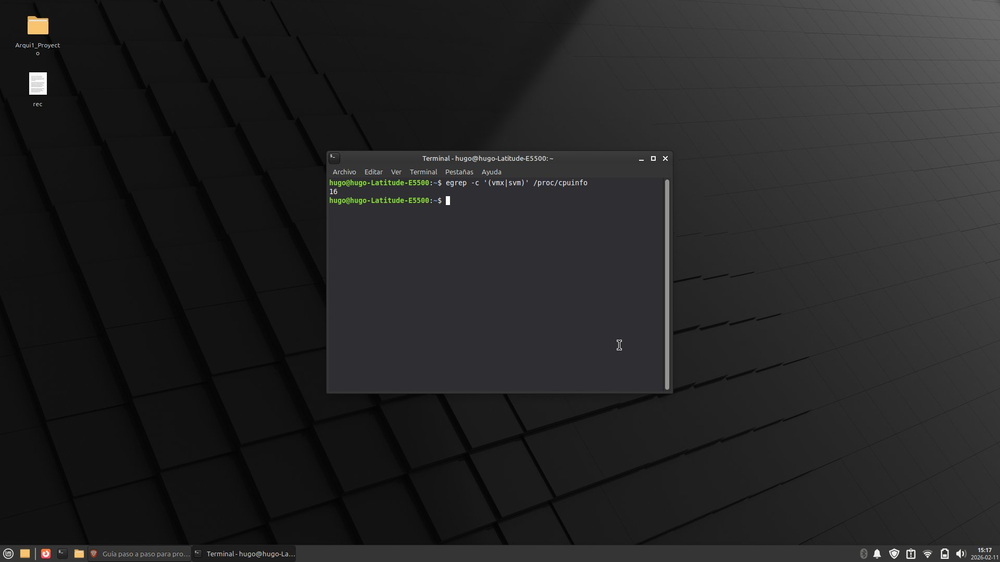
  <p><i>Figura 1: Comprobación de flags de virtualización en la CPU.</i></p>
</div>

### 2. Instalar KVM y herramientas complementarias
Actualiza los repositorios e instala los paquetes necesarios para KVM, libvirt y el administrador gráfico.

```bash
sudo apt update
sudo apt install -y qemu-kvm libvirt-daemon-system libvirt-clients bridge-utils virt-manager
```

<div align="center">
  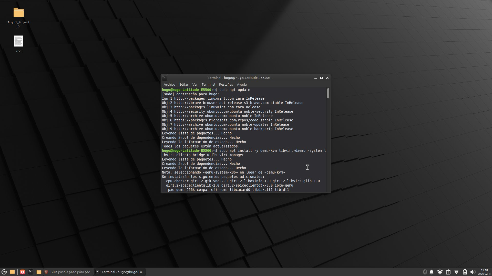
  <p><i>Figura 2: Instalación de KVM y herramientas.</i></p>
</div>

### 3. Verificar la aceleración KVM
La herramienta `kvm-ok` debe confirmar que la aceleración KVM puede ser usada.

```bash
kvm-ok
```

<div align="center">
  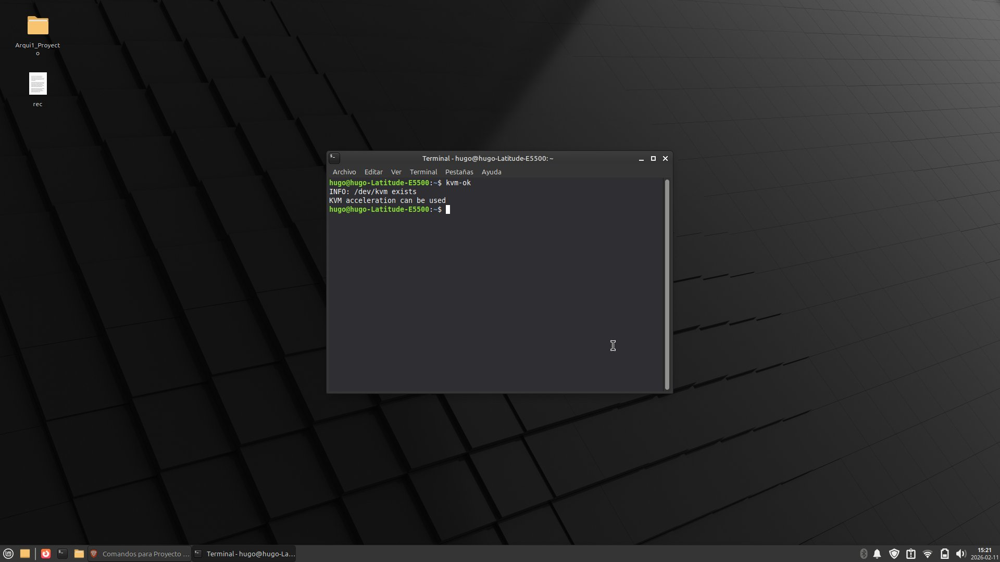
  <p><i>Figura 3: Salida esperada de kvm-ok.</i></p>
</div>

### 4. Agregar el usuario a los grupos `libvirt` y `kvm`
Esto permite administrar las máquinas virtuales sin necesidad de `sudo`. Es necesario reiniciar la sesión para que los cambios surtan efecto.

```bash
sudo adduser $USER libvirt
sudo adduser $USER kvm
```

<div align="center">
  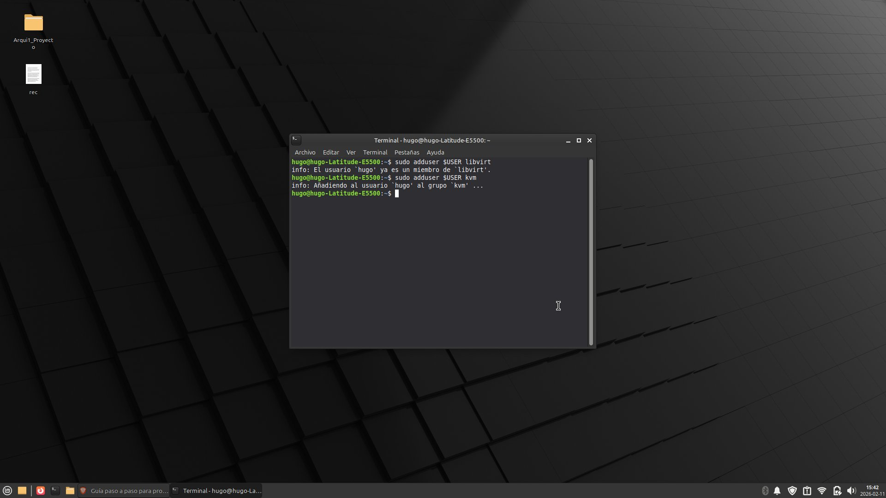
  <p><i>Figura 4: Agregando usuario a los grupos necesarios.</i></p>
</div>

### 5. Iniciar y habilitar el servicio libvirtd
```bash
sudo systemctl enable --now libvirtd
```

<div align="center">
  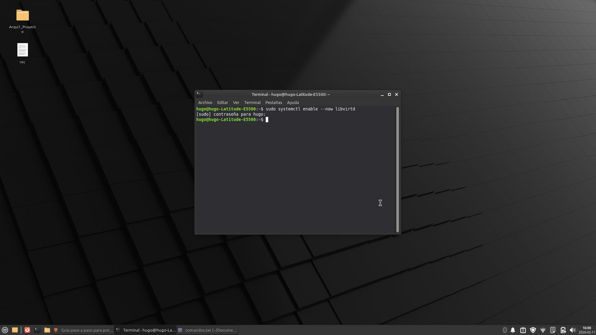
  <p><i>Figura 5: Habilitando el servicio libvirtd.</i></p>
</div>

### 6. Verificar el estado del servicio
```bash
sudo systemctl status libvirtd
```

<div align="center">
  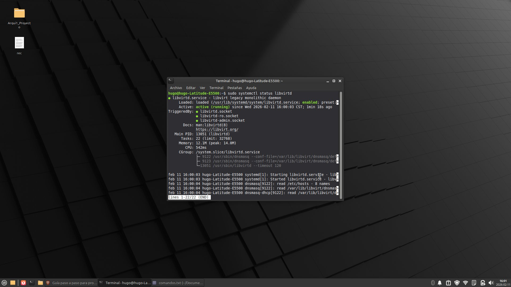
  <p><i>Figura 6: Verificación del estado del servicio libvirtd.</i></p>
</div>

## Configuración de las Máquinas Virtuales

### 7. Descargar la imagen de Ubuntu Server
```bash
wget https://releases.ubuntu.com/22.04.3/ubuntu-22.04.3-live-server-amd64.iso
```

<div align="center">
  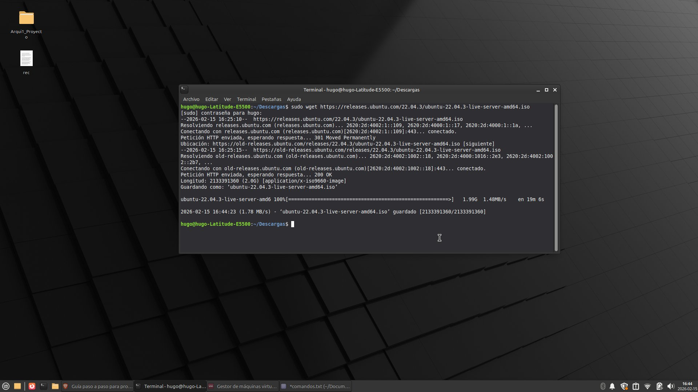
  <p><i>Figura 7: Descarga de la imagen ISO de Ubuntu Server.</i></p>
</div>

### 8. Crear la primera máquina virtual con Virt-Manager
Abre "Virtual Machine Manager" desde el menú de aplicaciones. Haz clic en el ícono "Crear una nueva máquina virtual" (el monitor con una estrella) o ve a Archivo > Nueva máquina virtual.

Selecciona la opción "Medio de instalación local (ISO imagen o CDROM)".

<div align="center">
  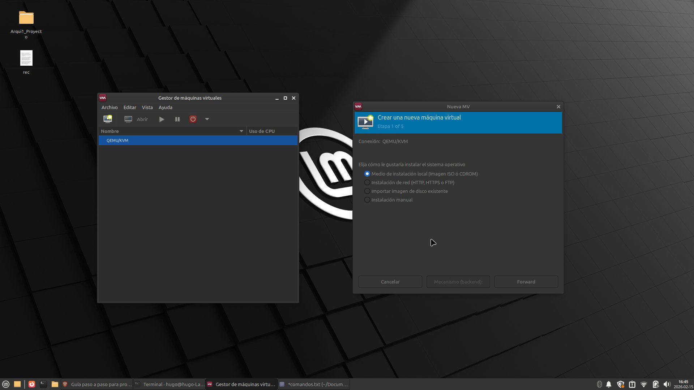
  <p><i>Figura 8: Selección del método de instalación.</i></p>
</div>

### 9. Explorar para buscar la ISO
Haz clic en el botón "Explorar...".

<div align="center">
  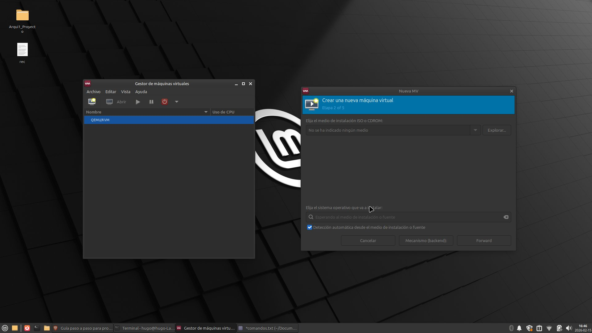
  <p><i>Figura 9: Iniciar la búsqueda de la imagen ISO.</i></p>
</div>

### 10. Buscar localmente
En la nueva ventana, haz clic en "Explorar localmente".

<div align="center">
  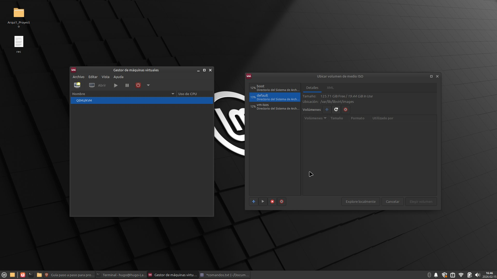
  <p><i>Figura 10: Opción para buscar en el sistema de archivos local.</i></p>
</div>

### 11. Seleccionar la ISO descargada
Navega hasta la ubicación del archivo `ubuntu-22.04.3-live-server-amd64.iso`, selecciónalo y haz clic en "Abrir".

<div align="center">
  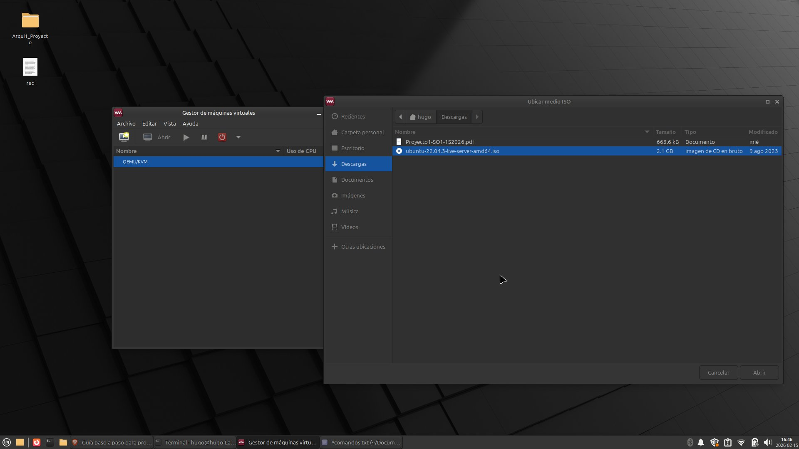
  <p><i>Figura 11: Selección del archivo ISO.</i></p>
</div>

### 12. Confirmar la selección de la ISO
Asegúrate de que la ruta de la ISO sea la correcta y haz clic en "Adelante".

<div align="center">
  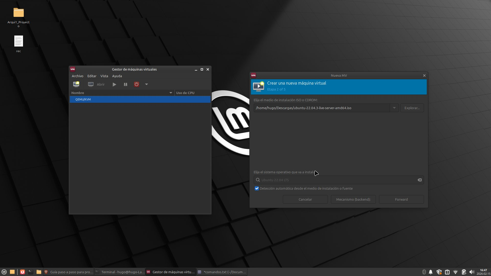
  <p><i>Figura 12: Confirmación del medio de instalación.</i></p>
</div>

### 13. Otorgar permisos de lectura
Si el sistema solicita permisos para leer la ISO, confirma haciendo clic en "Sí".

<div align="center">
  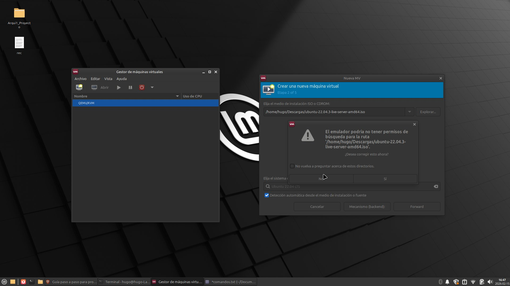
  <p><i>Figura 13: Permiso para acceder al archivo ISO.</i></p>
</div>

### 14. Configurar memoria RAM y CPUs
Asigna los recursos. Para este proyecto, las 3 máquinas virtuales (VM1, VM2, VM3) tendrán:
- **Memoria (RAM):** 1536 MB
- **CPUs:** 2

<div align="center">
  
  <p><i>Figura 14: Asignación de memoria RAM y núcleos de CPU.</i></p>
</div>

### 15. Configurar el espacio en disco
Habilita la opción de crear un disco virtual e indica el tamaño. Las 3 máquinas virtuales tendrán **15 GB**.

<div align="center">
  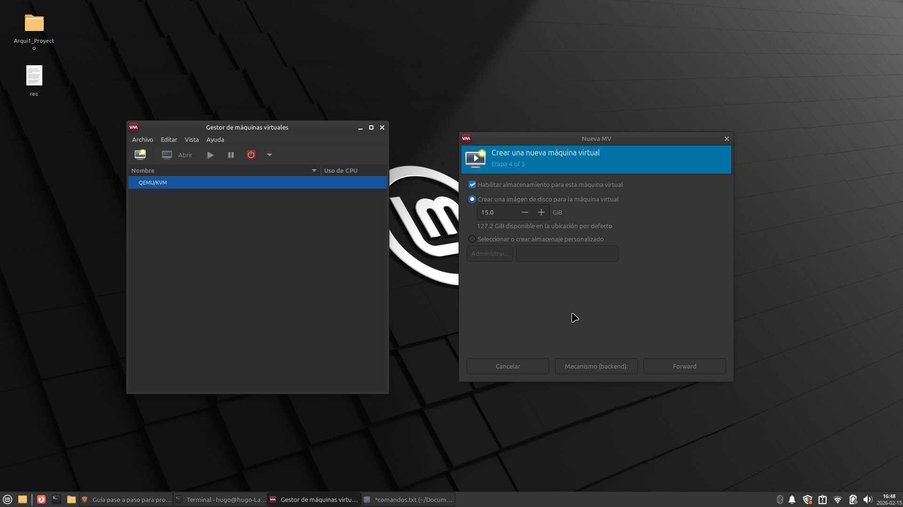
  <p><i>Figura 15: Configuración del tamaño del disco duro virtual.</i></p>
</div>

### 16. Revisar la configuración y finalizar
Revisa el resumen de la configuración. Marca la casilla "Personalizar la configuración antes de la instalación" si deseas hacer algún ajuste (como el nombre de la VM). Luego haz clic en "Finalizar".

<div align="center">
  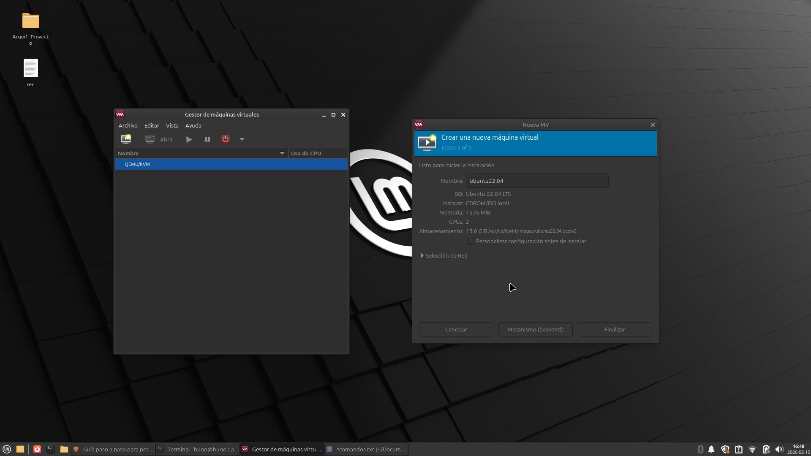
  <p><i>Figura 16: Resumen y finalización de la creación de la VM.</i></p>
</div>

### 17. Proceso de creación
Virt-Manager procederá a crear el disco virtual y preparar la máquina.

<div align="center">
  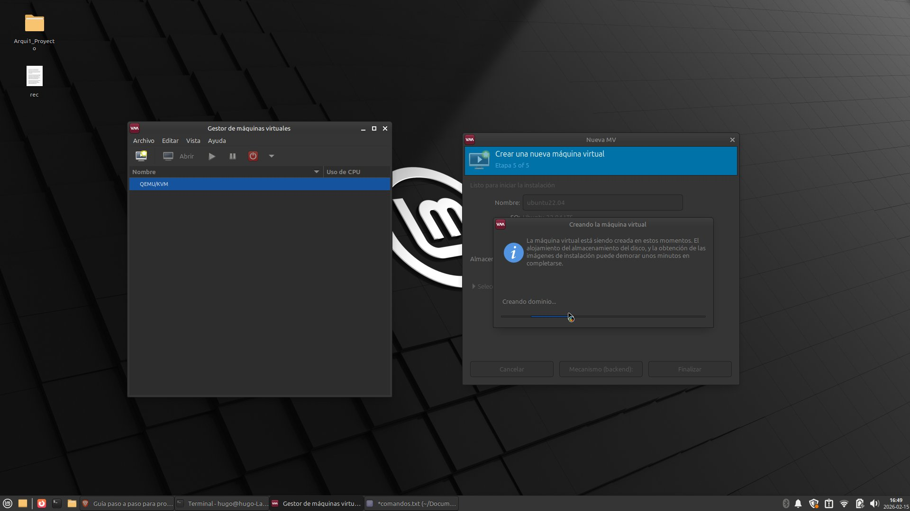
  <p><i>Figura 17: Proceso de creación de la máquina virtual.</i></p>
</div>

### 18. Iniciar la instalación del sistema operativo
La máquina virtual se iniciará automáticamente desde la ISO. En el menú de GRUB, selecciona **"Try or Install Ubuntu Server"** y presiona Enter.

<div align="center">
  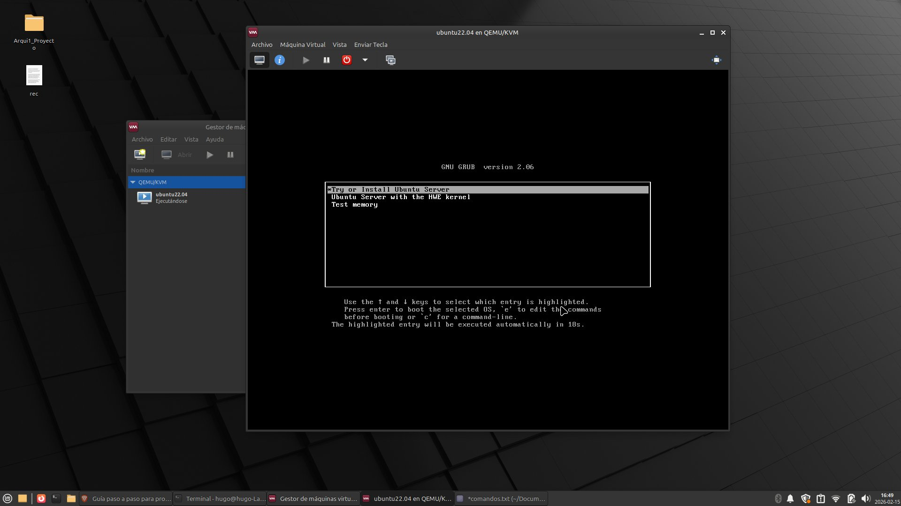
  <p><i>Figura 18: Menú de inicio de Ubuntu Server.</i></p>
</div>

### 19. Seleccionar el idioma
Elige el idioma de tu preferencia para el instalador (por ejemplo, "Español").

<div align="center">
  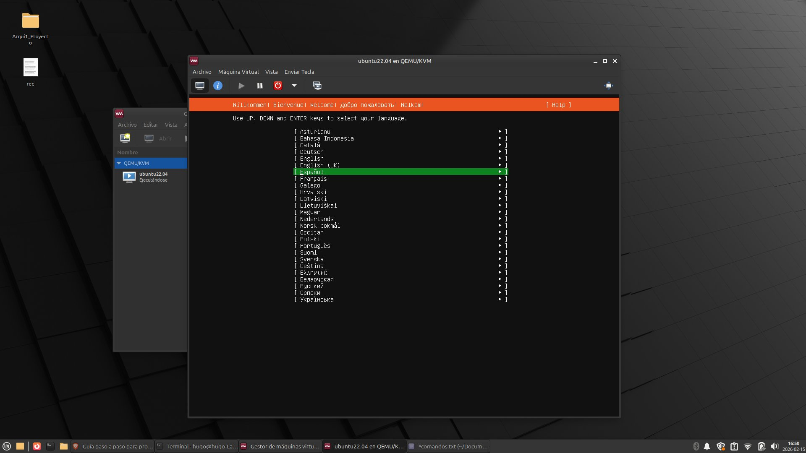
  <p><i>Figura 19: Selección del idioma del instalador.</i></p>
</div>

### 20. Confirmar disposición del teclado
El instalador mostrará la disposición y variante del teclado. Si es correcta, selecciona "Hecho" y presiona Enter.

<div align="center">
  
  <p><i>Figura 20: Confirmación de la disposición del teclado.</i></p>
</div>

### 21. Elegir el tipo de instalación
Selecciona **"Ubuntu Server (minimizado)"** para una instalación más ligera y sin paquetes innecesarios.

<div align="center">
  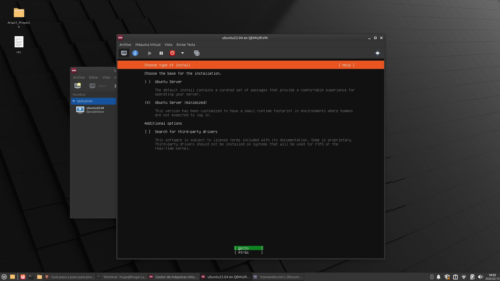
  <p><i>Figura 21: Selección del tipo de instalación "minimizado".</i></p>
</div>

### 22. Configuración de red
En la pantalla "Configurar una interfaz", por ahora selecciona "Hecho" para aceptar la configuración DHCP por defecto. La configuración de IP estática se realizará más adelante.

<div align="center">
  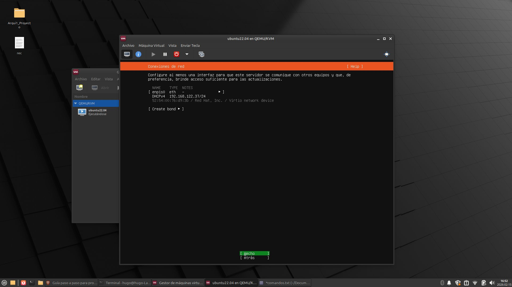
  <p><i>Figura 22: Configuración de red temporal.</i></p>
</div>

### 23. Configuración del mirror
El instalador buscará un mirror de Ubuntu automáticamente. Espera a que termine la búsqueda y selecciona "Hecho".

<div align="center">
  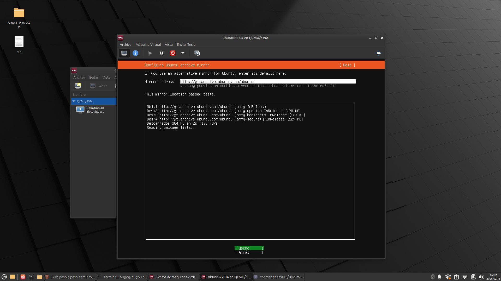
  <p><i>Figura 23: Selección del mirror de Ubuntu.</i></p>
</div>

### 24. Configuración del almacenamiento
Selecciona "Hecho" para usar la configuración de particionado por defecto en todo el disco.

<div align="center">
  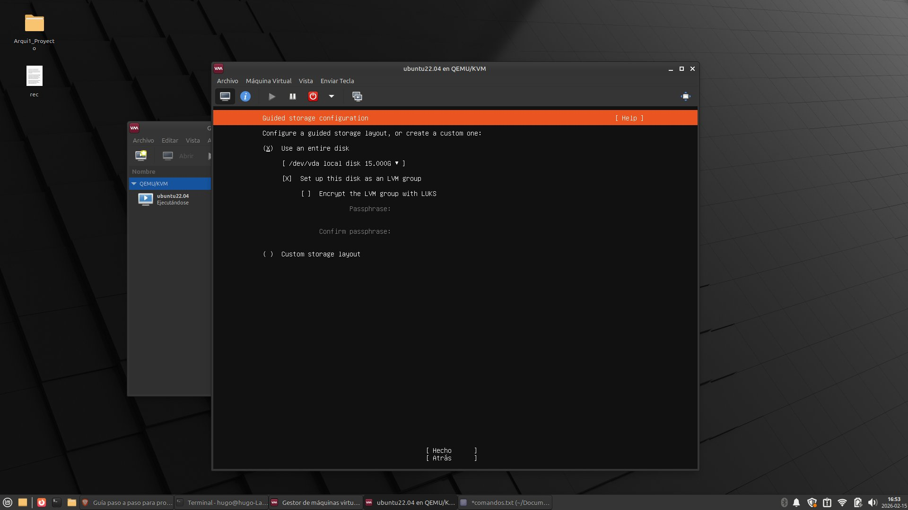
  <p><i>Figura 24: Configuración de almacenamiento por defecto.</i></p>
</div>

### 25. Confirmar el particionado
Se mostrará un resumen de la configuración de particiones. Selecciona "Hecho" para continuar.

<div align="center">
  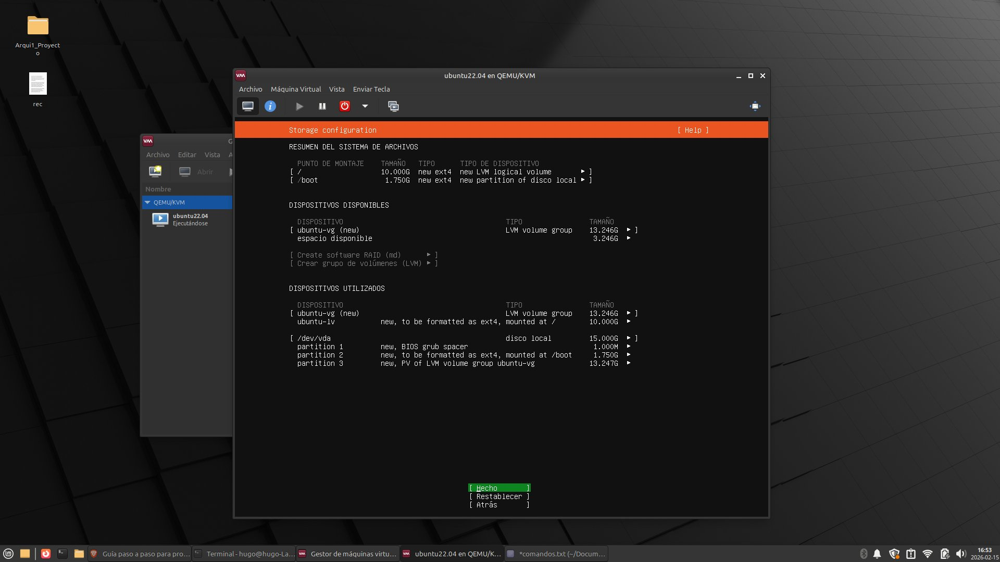
  <p><i>Figura 25: Resumen del esquema de particiones.</i></p>
</div>

### 26. Configurar perfil de usuario
Aquí es donde se configuran los datos de acceso. Anota bien estos datos, ya que se usarán para conectarse vía SSH.
- **Nombre:** (ej. Hugo Vásquez)
- **Nombre del servidor:** (ej. vm1-sopes)
- **Nombre de usuario:** `hugo_v1_201504070` (para VM1)
- **Contraseña:** `201504070`

Repite este proceso para cada VM, cambiando el usuario acorde:
- **VM1:** `hugo_v1_201504070`
- **VM2:** `hugo_v2_201504070`
- **VM3:** `hugo_v3_201504070`

<div align="center">
  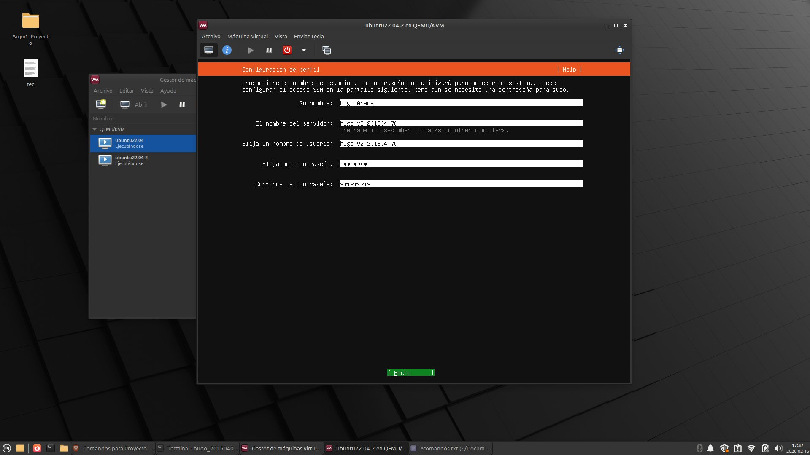
  <p><i>Figura 26: Configuración del nombre de usuario y contraseña.</i></p>
</div>

### 27. Configuración de Ubuntu Pro
El instalador preguntará si se desea mejorar a Ubuntu Pro. Selecciona **"Skip for now"** (Omitir por ahora).

<div align="center">
  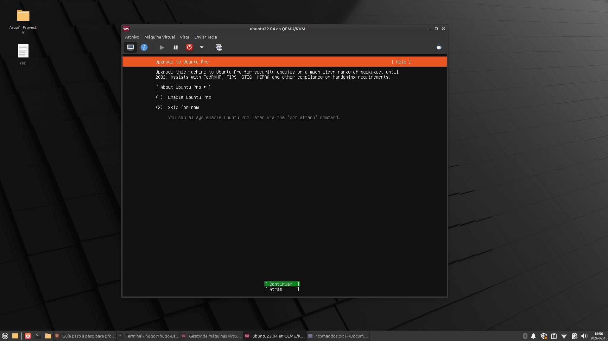
  <p><i>Figura 27: Omitir la configuración de Ubuntu Pro.</i></p>
</div>

### 28. Instalar OpenSSH Server
Es **fundamental** marcar la opción **"Instalar OpenSSH server"** para poder gestionar las máquinas virtuales de forma remota desde la terminal del host.

<div align="center">
  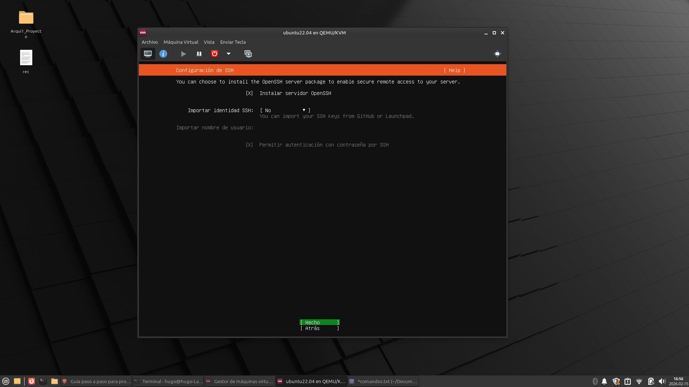
  <p><i>Figura 28: Selección de OpenSSH server para acceso remoto.</i></p>
</div>

### 29. Finalizar la instalación
El instalador copiará los archivos y configurará el sistema. Al finalizar, selecciona **"Reiniciar"**.

<div align="center">
  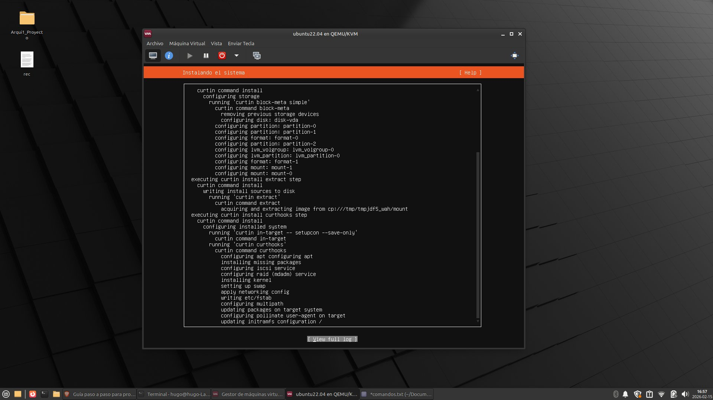
  <p><i>Figura 29: Finalización de la instalación y reinicio del sistema.</i></p>
</div>

### 30. Iniciar sesión por primera vez
Después del reinicio, inicia sesión con el usuario y la contraseña que configuraste en el paso 26.

<div align="center">
  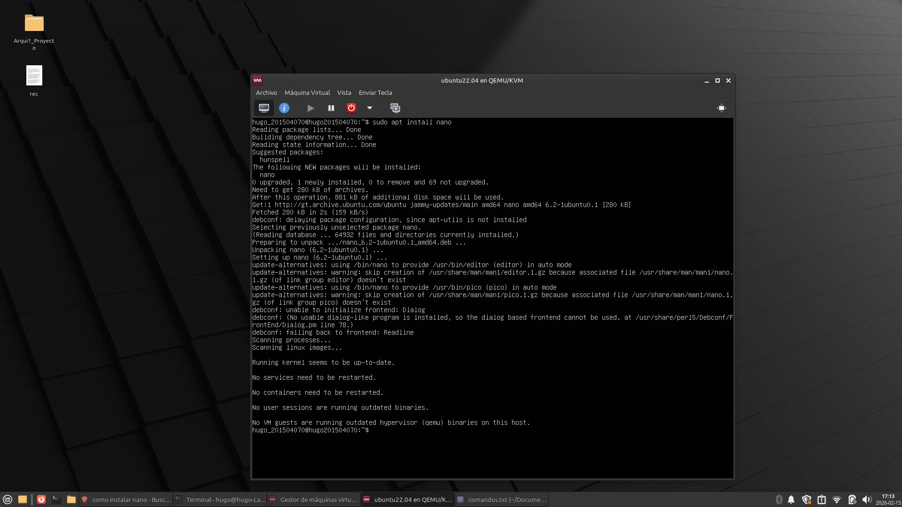
  <p><i>Figura 30: Inicio de sesión en la consola de la VM.</i></p>
</div>

## Configuración de Red (IP Estática)

### 31. Configurar IP estática en cada VM
Conéctate a cada máquina virtual (por SSH o desde su consola en virt-manager) y edita el archivo de configuración de Netplan.

Actualiza los paquetes e instala actualizaciones (opcional pero recomendado):
```bash
sudo apt update && sudo apt upgrade -y
```
Edita el archivo de configuración:
```bash
sudo nano /etc/netplan/00-installer-config.yaml
```
La configuración debe quedar similar a esta, ajustando la IP según la VM:

**VM1 (192.168.122.101):**
```yaml
network:
  ethernets:
    enp1s0:
      dhcp4: no
      addresses:
        - 192.168.122.101/24
      gateway4: 192.168.122.1
      nameservers:
        addresses: [8.8.8.8]
  version: 2
```
**VM2 (192.168.122.102):**
*Cambiar la IP a `192.168.122.102/24`*

**VM3 (192.168.122.103):**
*Cambiar la IP a `192.168.122.103/24`*

<div align="center">
  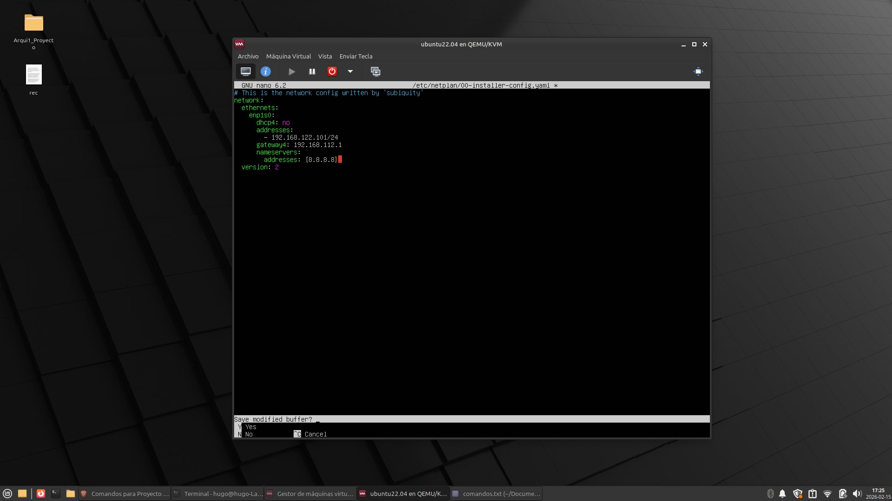
  <p><i>Figura 31: Edición del archivo de Netplan para IP estática.</i></p>
</div>

### 32. Aplicar la configuración de red
Guarda el archivo (Ctrl+O, Ctrl+X) y aplica los cambios con:
```bash
sudo netplan apply
```
Luego, puedes cerrar la sesión SSH o la consola.

<div align="center">
  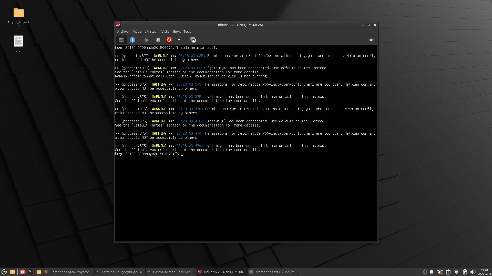
  <p><i>Figura 32: Aplicando la nueva configuración de red.</i></p>
</div>

## Preparación del Código de las APIs

### 33. Estructura del proyecto y acceso a VM3
En tu máquina física, crea la siguiente estructura de carpetas para las APIs en Go. El nombre del directorio raíz debe ser tu carnet.
```
201504070_LAB_SO1_1S2026/
├── api1/
│   ├── main.go
│   ├── Dockerfile
│   └── go.mod
├── api2/
│   ├── main.go
│   ├── Dockerfile
│   └── go.mod
└── api3/
    ├── main.go
    ├── Dockerfile
    └── go.mod
```
Una vez creado el código, conéctate a la **VM3** vía SSH:
```bash
ssh hugo_v3_201504070@192.168.122.103
```

<div align="center">
  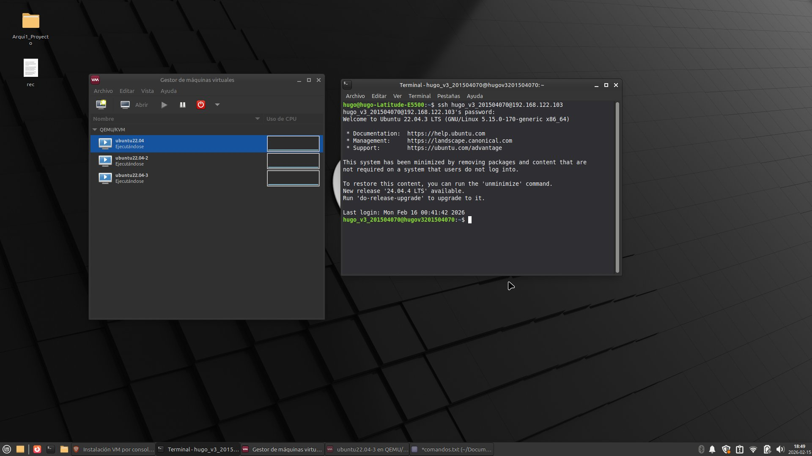
  <p><i>Figura 33: Conexión SSH exitosa a la VM3.</i></p>
</div>

## Configuración en VM3 (Docker y Zot)

### 34. Instalar Docker en VM3
Ya conectado a la VM3, instala Docker desde los repositorios oficiales de Ubuntu.
```bash
sudo apt update
sudo apt install -y docker.io
```

<div align="center">
  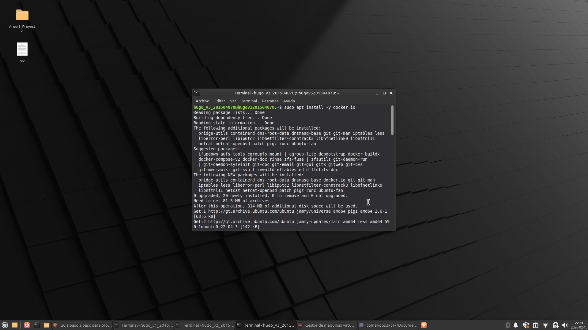
  <p><i>Figura 34: Instalación de Docker en VM3.</i></p>
</div>

### 35. Agregar usuario al grupo Docker
Para poder ejecutar comandos Docker sin `sudo`, agrega tu usuario al grupo `docker` y reinicia la sesión.
```bash
sudo usermod -aG docker $USER
sudo reboot
```
Después del reinicio, vuelve a conectarte vía SSH.

<div align="center">
  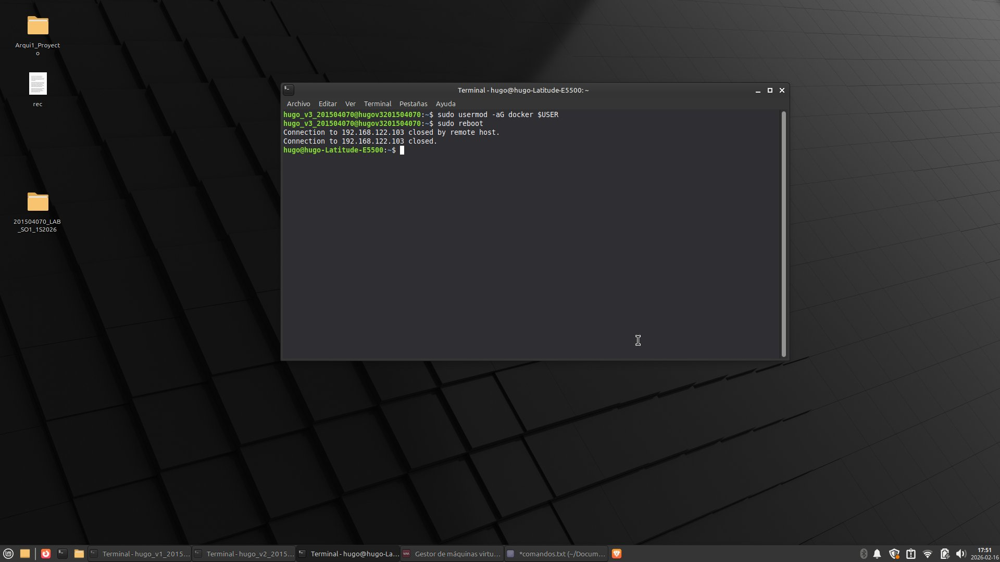
  <p><i>Figura 35: Agregando el usuario al grupo docker.</i></p>
</div>

### 36. Transferir el código del proyecto a VM3
Hay dos formas principales de hacerlo:

**Opción A: Usando Git (Recomendado)**
1. En tu máquina física, sube tu código a un repositorio en GitHub.
2. En VM3, clona el repositorio:
   ```bash
   git clone https://github.com/tu-usuario/201504070_LAB_SO1_1S2026.git
   ```
   Se te pedirá tu usuario y un token de acceso personal (no la contraseña de GitHub).

**Opción B: Usando `scp` (Copia Segura)**
Desde tu máquina física, ejecuta:
```bash
scp -r 201504070_LAB_SO1_1S2026 hugo_v3_201504070@192.168.122.103:/home/hugo_v3_201504070/
```

<div align="center">
  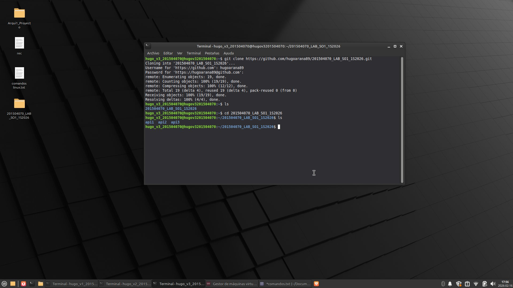
  <p><i>Figura 36: Transferencia del código mediante scp.</i></p>
</div>

### 37. Instalar y ejecutar Zot (Registro privado)
Zot será nuestro registro de imágenes privado. Lo ejecutaremos como un contenedor Docker.
```bash
sudo docker run -d -p 5000:5000 --name zot-registry ghcr.io/project-zot/zot-linux-amd64:latest
```
- `-d`: Modo "detached" (segundo plano).
- `-p 5000:5000`: Mapea el puerto 5000 del contenedor al puerto 5000 de la VM3.
- `--name zot-registry`: Asigna un nombre al contenedor.

<div align="center">
  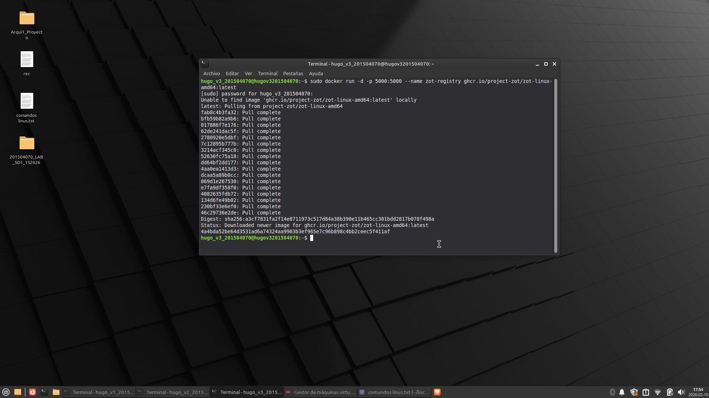
  <p><i>Figura 37: Ejecución del contenedor de Zot.</i></p>
</div>

### 38. Construir las imágenes Docker de las APIs
Navega a cada directorio de API y ejecuta el comando `docker build`. Asegúrate de que el Dockerfile exista en cada carpeta.
```bash
cd ~/201504070_LAB_SO1_1S2026/api1
sudo docker build -t api1-201504070:latest .

cd ~/201504070_LAB_SO1_1S2026/api2
sudo docker build -t api2-201504070:latest .

cd ~/201504070_LAB_SO1_1S2026/api3
sudo docker build -t api3-201504070:latest .
```

<div align="center">
  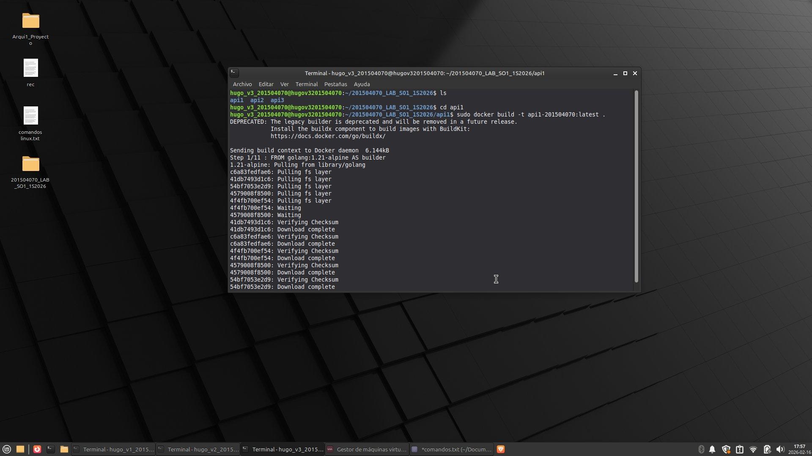
  <p><i>Figura 38: Construcción de las imágenes Docker para las APIs.</i></p>
</div>

### 39. Verificar las imágenes creadas
```bash
docker images
```
Este comando debe listar `api1-201504070`, `api2-201504070` y `api3-201504070`.

<div align="center">
  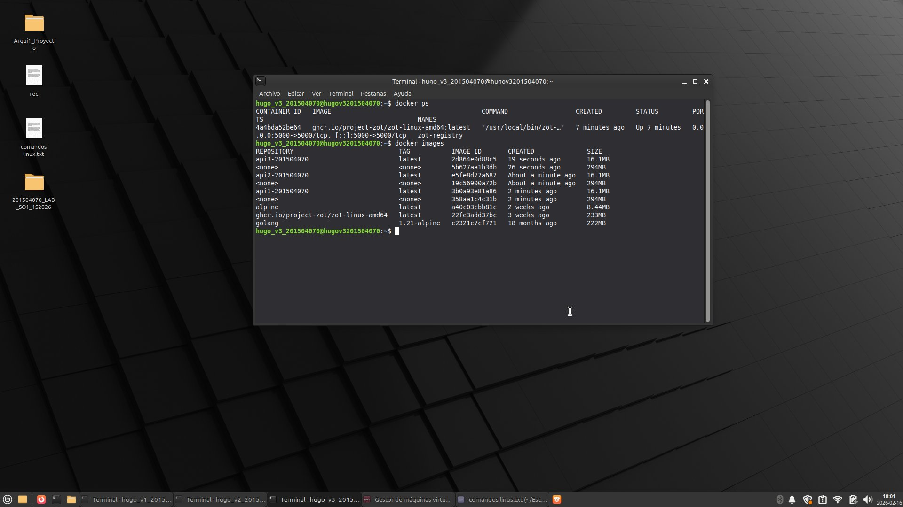
  <p><i>Figura 39: Listado de imágenes Docker construidas.</i></p>
</div>

### 40. Etiquetar las imágenes para Zot
Las imágenes deben ser etiquetadas con la dirección de nuestro registro para poder subirlas.
```bash
docker tag api1-201504070:latest localhost:5000/api1-201504070:latest
docker tag api2-201504070:latest localhost:5000/api2-201504070:latest
docker tag api3-201504070:latest localhost:5000/api3-201504070:latest
```

<div align="center">
  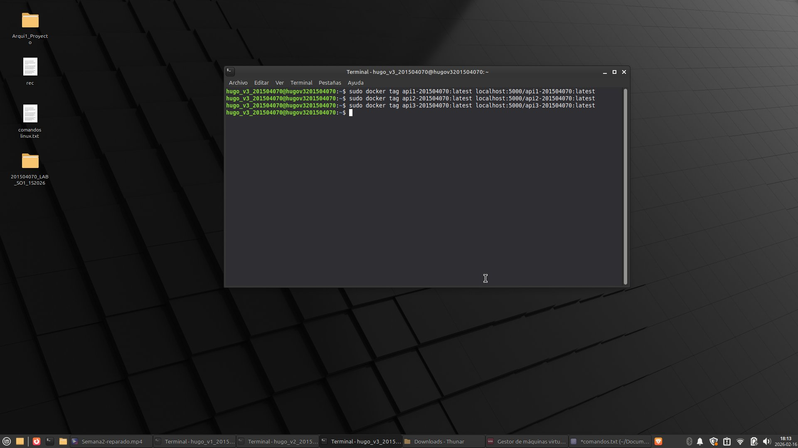
  <p><i>Figura 40: Etiquetado de imágenes para el registro local.</i></p>
</div>

### 41. Subir las imágenes a Zot (Push)
```bash
docker push localhost:5000/api1-201504070:latest
docker push localhost:5000/api2-201504070:latest
docker push localhost:5000/api3-201504070:latest
```

<div align="center">
  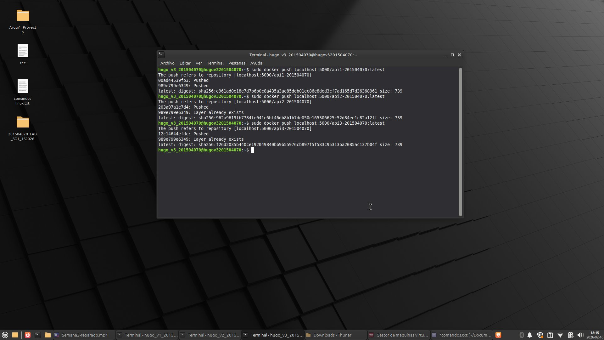
  <p><i>Figura 41: Subida de imágenes al registro Zot.</i></p>
</div>

### 42. Verificar las imágenes en el registro Zot
Consulta el catálogo del registro para confirmar que las imágenes están disponibles.
```bash
curl http://192.168.122.103:5000/v2/_catalog
```
La respuesta debe ser un JSON con los nombres de las imágenes.

<div align="center">
  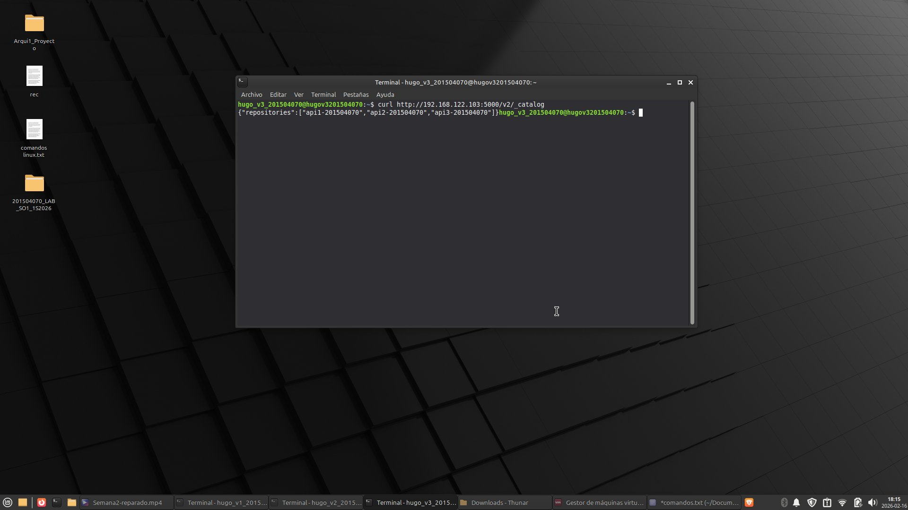
  <p><i>Figura 42: Verificación de imágenes en el registro Zot.</i></p>
</div>

## Configuración en VM1 y VM2 (Containerd)

### 43. Acceder a VM1 y VM2 e instalar Containerd
Desde tu máquina física, abre dos terminales y conéctate a VM1 y VM2.

**VM1:**
```bash
ssh hugo_v1_201504070@192.168.122.101
```
**VM2:**
```bash
ssh hugo_v2_201504070@192.168.122.102
```

En **cada una** de estas máquinas, instala `containerd`:
```bash
sudo apt update
sudo apt install -y containerd
```

<div align="center">
  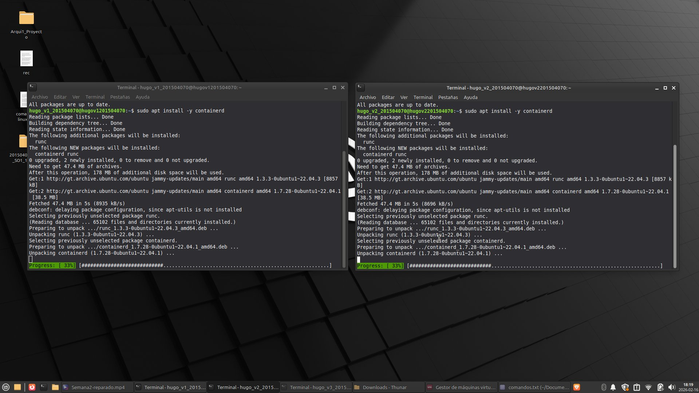
  <p><i>Figura 43: Instalación de Containerd en VM1 y VM2.</i></p>
</div>

Después de la instalación, asegúrate de que el servicio esté corriendo y habilitado:
```bash
sudo systemctl restart containerd
sudo systemctl enable containerd
```

### 44. Configurar Containerd para usar el registro inseguro (HTTP)
Zot está corriendo sin HTTPS (solo HTTP). Containerd necesita una configuración especial para permitir la comunicación con un registro inseguro (plain HTTP).

Primero, genera el archivo de configuración por defecto:
```bash
sudo mkdir -p /etc/containerd
containerd config default | sudo tee /etc/containerd/config.toml
```
Probar primero lo anterior, si no funciona y da error de conexión al intentar conectar a https en lugar de http, entonces se debe editar el archivo para agregar la configuración del registro inseguro:
```bash
sudo nano /etc/containerd/config.toml
```
Busca la sección `[plugins."io.containerd.grpc.v1.cri".registry]` y dentro de ella, `[plugins."io.containerd.grpc.v1.cri".registry.configs]` y `[plugins."io.containerd.grpc.v1.cri".registry.mirrors]`. Debes agregar la IP de VM3 como un mirror y como un endpoint inseguro.

La configuración final debería verse similar a esto:
```toml
version = 2
[plugins]
  [plugins."io.containerd.grpc.v1.cri"]
    [plugins."io.containerd.grpc.v1.cri".registry]
      [plugins."io.containerd.grpc.v1.cri".registry.mirrors]
        [plugins."io.containerd.grpc.v1.cri".registry.mirrors."192.168.122.103:5000"]
          endpoint = ["http://192.168.122.103:5000"]
      [plugins."io.containerd.grpc.v1.cri".registry.configs]
        [plugins."io.containerd.grpc.v1.cri".registry.configs."192.168.122.103:5000".tls]
          insecure_skip_verify = true
```
Después de guardar los cambios, reinicia `containerd`:
```bash
sudo systemctl restart containerd
```

<div align="center">
  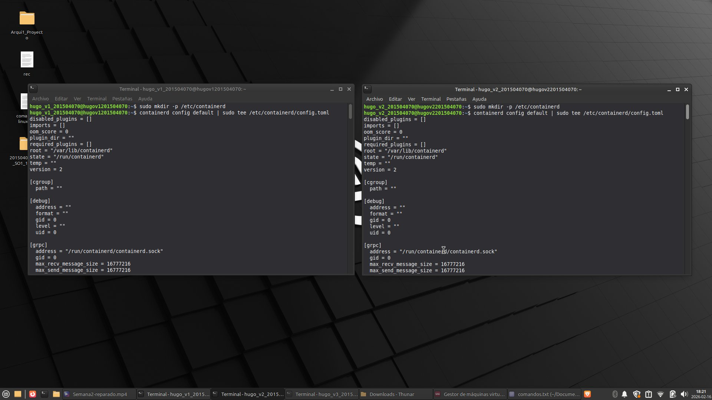
  <p><i>Figura 44: Edición del archivo config.toml de Containerd.</i></p>
</div>

### 45. Probar conectividad con el registro de VM3
Desde VM1 y VM2, verifica que puedan acceder al catálogo de Zot.
```bash
curl http://192.168.122.103:5000/v2/_catalog
```

<div align="center">
  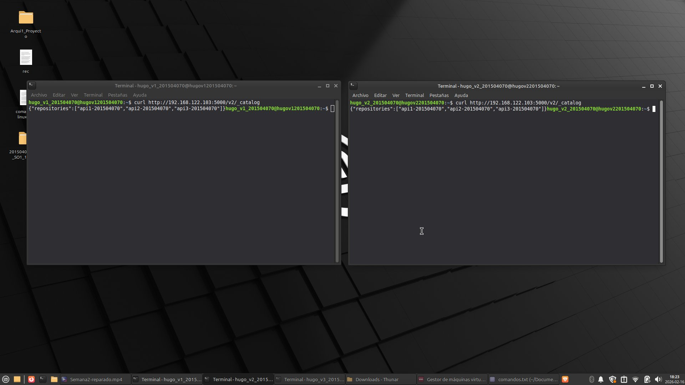
  <p><i>Figura 45: Prueba de conectividad con el registro Zot desde VM1/VM2.</i></p>
</div>

### 46. Descargar (Pull) las imágenes desde Zot
**En VM1**, descarga las imágenes de API1 y API2:
```bash
sudo ctr image pull --plain-http 192.168.122.103:5000/api1-201504070:latest
sudo ctr image pull --plain-http 192.168.122.103:5000/api2-201504070:latest
```
**En VM2**, descarga la imagen de API3:
```bash
sudo ctr image pull --plain-http 192.168.122.103:5000/api3-201504070:latest
```
La bandera `--plain-http` es crucial para comunicarse con un registro HTTP.

<div align="center">
  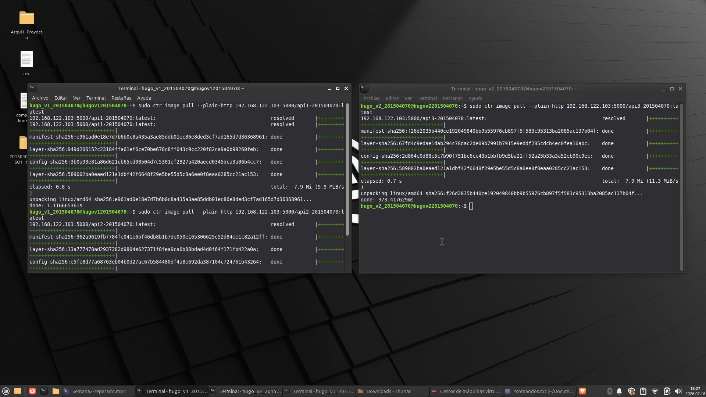
  <p><i>Figura 46: Descarga de imágenes desde Zot usando ctr.</i></p>
</div>

### 47. Verificar las imágenes descargadas
```bash
sudo ctr images list
```

<div align="center">
  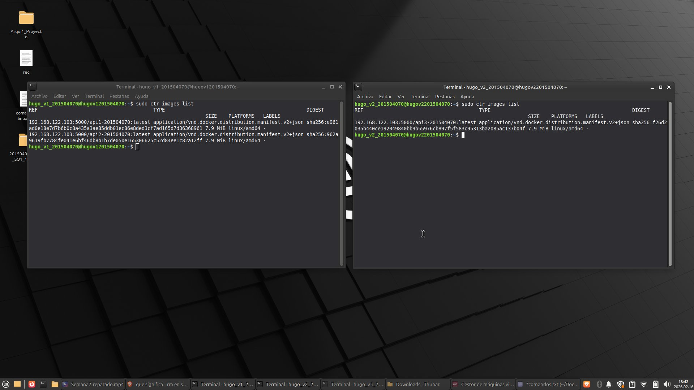
  <p><i>Figura 47: Listado de imágenes descargadas en VM1/VM2.</i></p>
</div>

## Ejecución de los Contenedores

### 48. Ejecutar los contenedores (Primer plano)
Para una primera prueba, ejecuta los contenedores en primer plano para ver los logs directamente.

**Terminal 1 (VM1 - API1):**
```bash
ssh hugo_v1_201504070@192.168.122.101
sudo ctr run --rm -t --net-host 192.168.122.103:5000/api1-201504070:latest api1
```
**Terminal 2 (VM1 - API2):**
```bash
ssh hugo_v1_201504070@192.168.122.101
sudo ctr run --rm -t --net-host 192.168.122.103:5000/api2-201504070:latest api2
```
**Terminal 3 (VM2 - API3):**
```bash
ssh hugo_v2_201504070@192.168.122.102
sudo ctr run --rm -t --net-host 192.168.122.103:5000/api3-201504070:latest api3
```
- `--rm`: Elimina el contenedor cuando este se detiene.
- `-t`: Asigna una pseudo-TTY.
- `--net-host`: Usa la red del host, lo que permite que las APIs sean accesibles en la IP de la VM sin necesidad de mapear puertos.
- `api1`/`api2`/`api3`: Es el nombre que le damos al contenedor en ejecución.

<div align="center">
  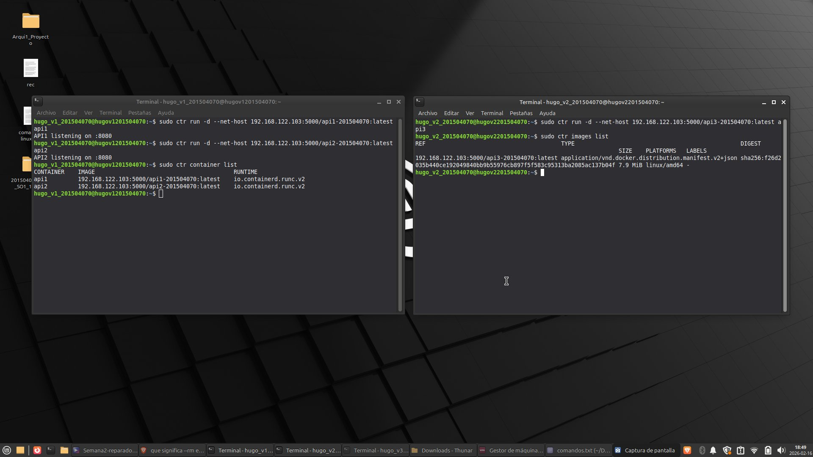
  <p><i>Figura 48: Ejecución del contenedor API1 en primer plano.</i></p>
</div>

### 49. Verificar la ejecución de los contenedores
En otra terminal, conectada a la VM correspondiente, puedes listar los contenedores y sus tareas.

**Listar contenedores:**
```bash
sudo ctr container list
```
**Listar tareas (procesos en ejecución dentro de contenedores):**
```bash
sudo ctr task list
```

<div align="center">
  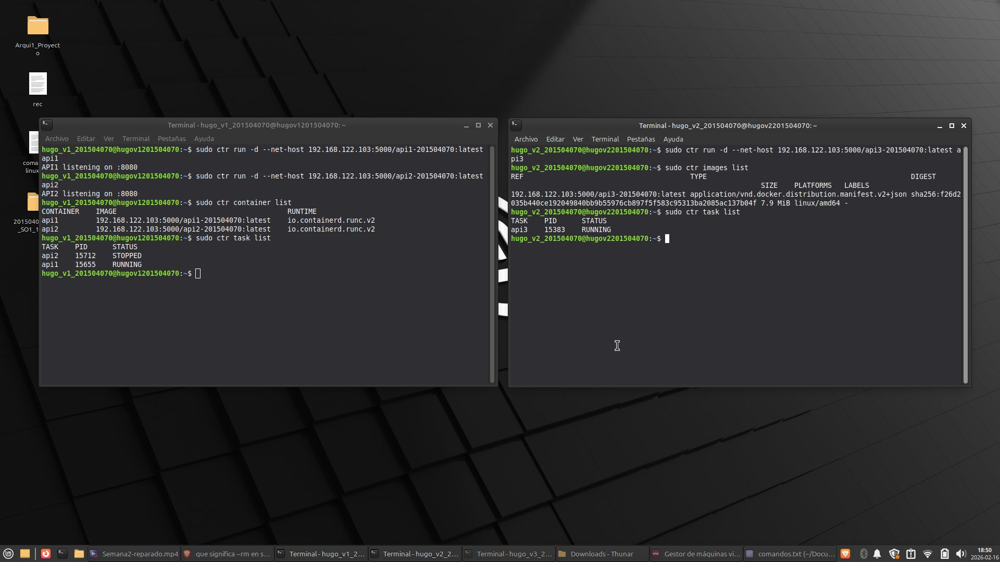
  <p><i>Figura 49: Verificación de contenedores y tareas activas.</i></p>
</div>

### 50. Ejecutar contenedores en segundo plano (Modo Daemon)
Para un funcionamiento más práctico, los contenedores deben correr en segundo plano con la bandera `-d`.

**En VM1:**
```bash
sudo ctr run -d --net-host 192.168.122.103:5000/api1-201504070:latest api1
sudo ctr run -d --net-host 192.168.122.103:5000/api2-201504070:latest api2
```
**En VM2:**
```bash
sudo ctr run -d --net-host 192.168.122.103:5000/api3-201504070:latest api3
```

### 51. Detener y eliminar contenedores (Limpieza)
Si necesitas detener un contenedor que corre en segundo plano (por ejemplo, tras un reinicio de la VM), debes eliminar la tarea y luego el contenedor.

**Para API1 en VM1:**
```bash
sudo ctr task kill api1
sudo ctr task rm api1
sudo ctr container rm api1
```
Repite el proceso para `api2` en VM1 y `api3` en VM2. Siempre verifica con `sudo ctr container list` y `sudo ctr task list` que hayan sido eliminados correctamente.

<div align="center">
  
  <p><i>Figura 50: Proceso de eliminación de un contenedor y su tarea.</i></p>
</div>