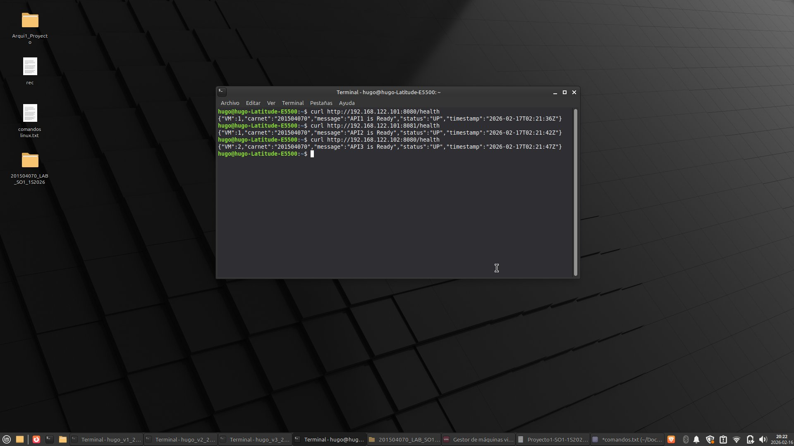
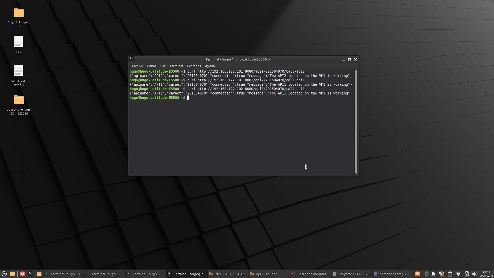
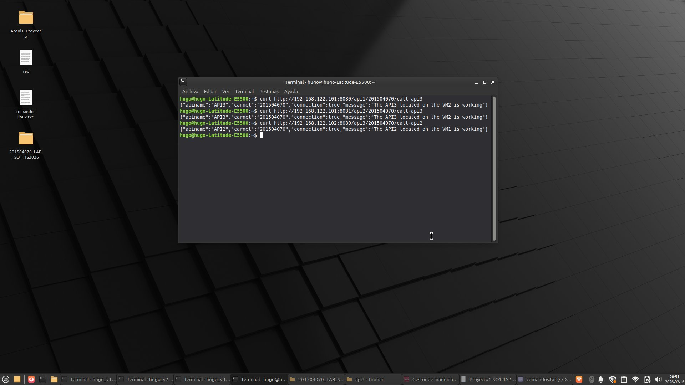

# Evidencia de Pruebas de Funcionalidad

## Endpoints del Proyecto

A continuación se presentan las tablas con los endpoints requeridos según el enunciado, utilizando el carnet del estudiante: **201504070**.

### Tabla de Endpoints Especificados

| API | Endpoint Principal | Endpoint de Llamada 1 | Endpoint de Llamada 2 |
| :--- | :---: | :--- | :---: |
| API1 | `GET /health` | `GET /api1/201504070/call-api2` | `GET /api1/201504070/call-api3` |
| API2 | `GET /health` | `GET /api2/201504070/call-api1` | `GET /api2/201504070/call-api3` |
| API3 | `GET /health` | `GET /api3/201504070/call-api1` | `GET /api3/201504070/call-api2` |

### Tabla de Endpoints con IPs de las Máquinas Virtuales

| API | Endpoint Principal | Endpoint de Llamada 1 | Endpoint de Llamada 2 |
| :--- | :---: | :--- | :---: |
| **API1** (VM1) | `curl http://192.168.122.101:8080/health` | `curl http://192.168.122.101:8080/api1/201504070/call-api2` | `curl http://192.168.122.101:8080/api1/201504070/call-api3` |
| **API2** (VM1) | `curl http://192.168.122.101:8081/health` | `curl http://192.168.122.101:8081/api2/201504070/call-api1` | `curl http://192.168.122.101:8081/api2/201504070/call-api3` |
| **API3** (VM2) | `curl http://192.168.122.102:8080/health` | `curl http://192.168.122.102:8080/api3/201504070/call-api1` | `curl http://192.168.122.102:8080/api3/201504070/call-api2` |

---

## Pruebas de Endpoints Principales (Health Check)

Estos endpoints verifican que cada API esté funcionando correctamente y responden con el estado "UP", la marca de tiempo, la VM donde se ejecuta y el carnet del estudiante.

  
  
<i>Figura 1: Verificación del endpoint /health en cada API. Se confirma que todas las APIs responden con "status": "UP" y los datos requeridos.</i>

---

## Pruebas de Comunicación entre APIs - Llamada 1

Estos endpoints demuestran que las APIs pueden comunicarse entre sí. Por ejemplo, API1 consulta a API2 para verificar su estado.

  
  
<i>Figura 2: Verificación de los endpoints de llamada 1. Se muestra la comunicación exitosa entre API1 → API2, API2 → API1 y API3 → API1.</i>

---

## Pruebas de Comunicación entre APIs - Llamada 2

Estos endpoints complementan la verificación de la comunicación cruzada entre todas las APIs del sistema.

  
  
<i>Figura 3: Verificación de los endpoints de llamada 2. Se muestra la comunicación exitosa entre API1 → API3, API2 → API3 y API3 → API2.</i>

---

## Resumen de Pruebas Realizadas

| Prueba | Endpoint | Resultado Esperado | Resultado Obtenido |
| :--- | :--- | :--- | :--- |
| Health Check API1 | `GET /health` | JSON con `status: "UP"` | ✅ Correcto |
| Health Check API2 | `GET /health` | JSON con `status: "UP"` | ✅ Correcto |
| Health Check API3 | `GET /health` | JSON con `status: "UP"` | ✅ Correcto |
| Comunicación API1 → API2 | `GET /api1/201504070/call-api2` | `connection: true` | ✅ Correcto |
| Comunicación API2 → API1 | `GET /api2/201504070/call-api1` | `connection: true` | ✅ Correcto |
| Comunicación API3 → API1 | `GET /api3/201504070/call-api1` | `connection: true` | ✅ Correcto |
| Comunicación API1 → API3 | `GET /api1/201504070/call-api3` | `connection: true` | ✅ Correcto |
| Comunicación API2 → API3 | `GET /api2/201504070/call-api3` | `connection: true` | ✅ Correcto |
| Comunicación API3 → API2 | `GET /api3/201504070/call-api2` | `connection: true` | ✅ Correcto |

---

## Conclusión

Todas las pruebas de funcionalidad han sido completadas exitosamente. Se verifica que:

1. **Las 3 APIs** responden correctamente al endpoint `/health` con el formato JSON requerido.
2. **La comunicación cruzada** entre todas las APIs funciona correctamente, demostrando que los contenedores pueden comunicarse a través de la red.
3. **El flujo completo** del sistema opera según lo especificado en el enunciado del proyecto.

Las pruebas confirman que la infraestructura de contenedores (Containerd en VM1/VM2 y Docker con Zot en VM3) está correctamente configurada y operativa.