**UNIVERSIDAD DE SAN CARLOS DE GUATEMALA**   
**FACULTAD DE INGENIERÍA**  
**INGENIERÍA EN SISTEMAS**  
**SISTEMAS OPERATIVOS 1**  
**PRIMER SEMESTRE DE 2026**

| Registro académico: 201504070  | CUI: 3236666040511 |
| :---- | :---- |
| **Nombre:** Hugo Jorge Luis Perez Arana | **Proyecto:** 2 |
| **Aux:** Jose Daniel Lorenza Medina | **Sección:** P |

---

# Monitoreo de Unidades Militares en la Nube con Kubernete


Todas las configuraciones se harán atravez de wsl.

## 1. Copiar la carpeta del proyecto a la ruta:

```bash
\\wsl.localhost\Ubuntu\home\hugoarana15\201504070_LAB_SO1_1S2026\Proyecto3
```

## 2. Acceder a wsl en la consola y abrir el proyecto

```bash
wsl
cd ~
cd "ruta_del_proyecto"
code .
```

<div align="center">
  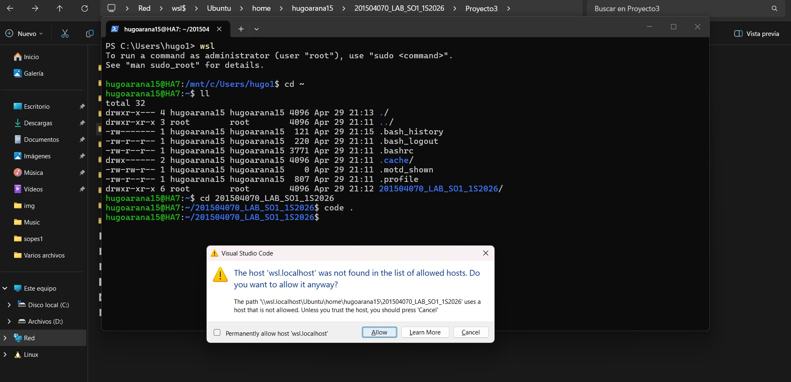
</div>

## 3. Instalar docker y docker compose

### 1. Preparar el sistema

```bash
sudo apt update && sudo apt upgrade -y
sudo apt install ca-certificates curl gnupg lsb-release -y
```

### 2. Agregar la clave GPG oficial de Docker
Esto asegura que el software que descargues esté firmado correctamente:

```bash
sudo install -m 0755 -d /etc/apt/keyrings
curl -fsSL https://download.docker.com/linux/ubuntu/gpg | sudo gpg --dearmor -o /etc/apt/keyrings/docker.gpg
sudo chmod a+r /etc/apt/keyrings/docker.gpg
```

### 3. Configurar el repositorio
Ejecutar este comando para añadir el repositorio de Docker a las fuentes de `apt`:

```bash
echo \
  "deb [arch=$(dpkg --print-architecture) signed-by=/etc/apt/keyrings/docker.gpg] https://download.docker.com/linux/ubuntu \
  $(. /etc/os-release && echo "$VERSION_CODENAME") stable" | \
  sudo tee /etc/apt/sources.list.d/docker.list > /dev/null
```

### 4. Instalar Docker Engine y Docker Compose
Ahora instala el motor de Docker y el plugin de Compose (V2):

```bash
sudo apt update
sudo apt install docker-ce docker-ce-cli containerd.io docker-buildx-plugin docker-compose-plugin -y
```

---

### 5. Configuración Post-Instalación
Para evitar escribir `sudo` cada vez que se use un comando de Docker:

1.  **Crear el grupo docker:**
    ```bash
    sudo groupadd docker
    ```
2.  **Añadir tu usuario al grupo:**
    ```bash
    sudo usermod -aG docker $USER
    ```
3.  **Aplicar los cambios:** (o simplemente cerrar y abrir la terminal)
    ```bash
    newgrp docker
    ```

### 6. Iniciar el servicio en WSL
A diferencia de una instalación nativa en Linux, WSL no siempre inicia los servicios automáticamente. Ejecuta:
```bash
sudo service docker start
```

### 7. Verificar instalación

```bash
sudo service docker status
```

---

## Instalar gcloud en WSL

### 1. Instalar gcloud en WSL

```bash
sudo apt update
sudo apt install -y apt-transport-https ca-certificates gnupg curl

# Agregar repositorio oficial
echo "deb [signed-by=/usr/share/keyrings/cloud.google.gpg] https://packages.cloud.google.com/apt cloud-sdk main" | sudo tee /etc/apt/sources.list.d/google-cloud-sdk.list

# Importar clave
curl https://packages.cloud.google.com/apt/doc/apt-key.gpg | sudo gpg --dearmor -o /usr/share/keyrings/cloud.google.gpg

# Instalar
sudo apt update
sudo apt install -y google-cloud-sdk
```

---

## 🚀 2. Inicializar (login)

```bash
gcloud init
```

Esto:

* Abre un link en el navegador
* Hacer login con la cuenta de Google
* Elegir proyecto

<div align="center">
  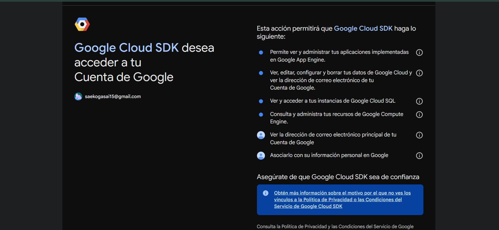
</div>

---

## 🔑 3. Login rápido (alternativa)

Si no quieres el asistente:

```bash
gcloud auth login
```

---

## 📌 4. Seleccionar proyecto

1. Elegir el proyecto configurado en google cloud.
2. Elegir la zona del proyecto en este caso se ha elegido: [9] us-central1-a


<div align="center">
  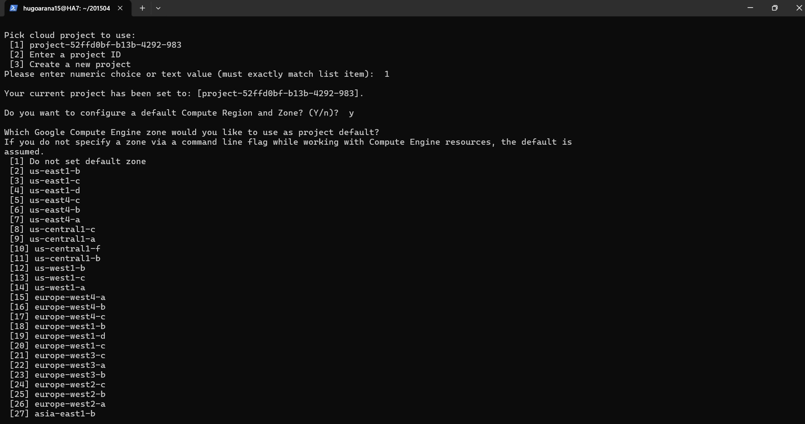
</div>


Ver el actual:

```bash
gcloud config list
```

Si se quiere cambiar de proyecto:

```bash
gcloud config set project TU_PROJECT_ID
```

---

## 🧪 5. Probar que funciona

```bash
gcloud info
```

---

## 🐳 6. (IMPORTANTE para Docker/Zot)

Configurar acceso a registries:

```bash
gcloud auth configure-docker
```

👉 Esto permite hacer:

```bash
docker push
docker pull
```

a registries de Google (como Artifact Registry)

---

## 🧹 Si quieres resetear gcloud

```bash
rm -rf ~/.config/gcloud
```

---


## Configurar maquina virtual para zot

Primero habilitar puertos en Firewall > Políticas de firewall > Crear regla de firewall

<div align="center">
  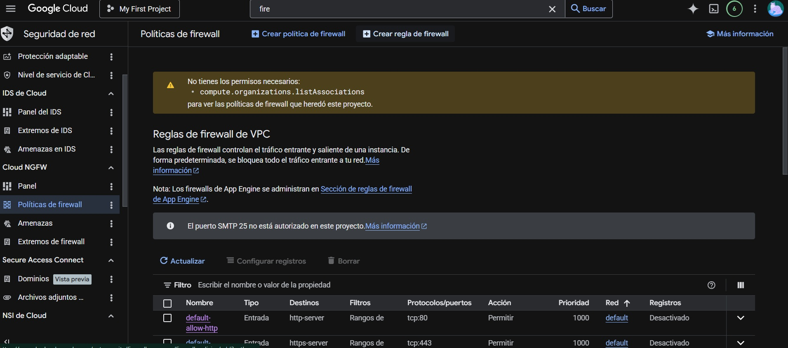
</div>

---

Colocar nombre, descripción y una etíqueta que posteriormente se usará en la creación de maquina virtual

<div align="center">
  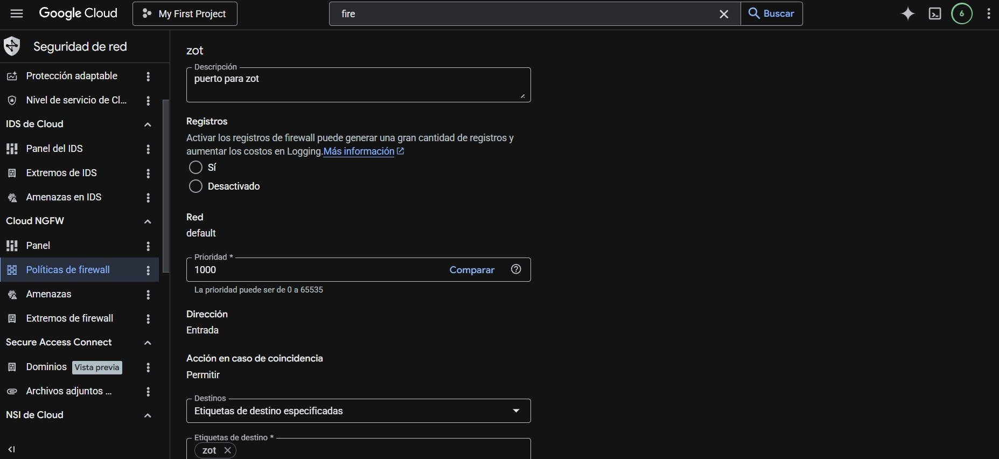
</div>

---

Colocar en puerto 5000 que es el que utilizará zot, en rango colocar TCP 0.0.0.0/0 que significa que se aceptara todo el tráfico por ese puerto.

<div align="center">
  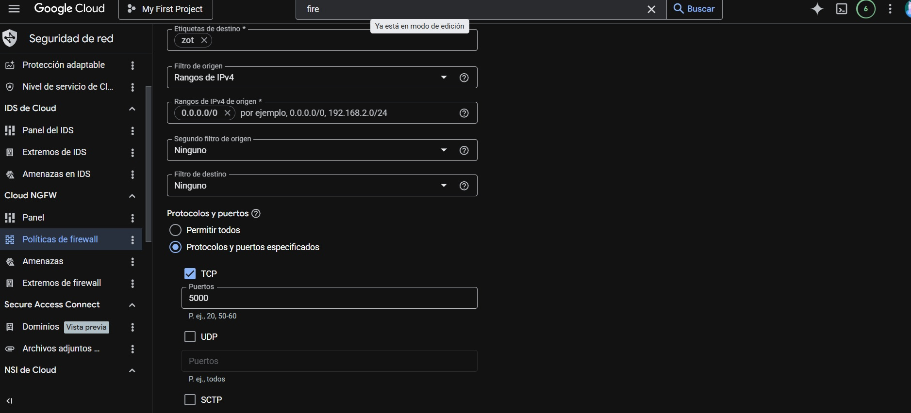
</div>
---

## Crear maquina virtual

En el buscador colocar "Instancias de VM" y crear nueva VM

Para este proyecto se ha elegído:

**Nombre:** zot-registry
**Región:** us-central1
**zona:** us-central1-a
**Tipo de maquina:** E2 (2 CPU virtuales, 1 Nucleo y 2 Gb de memoria Ram)
**Sistema operativo:** x86/x64 Ubuntu 24.04 LTS Minimal
**Tamaño de disco:** 50GB

<div align="center">
  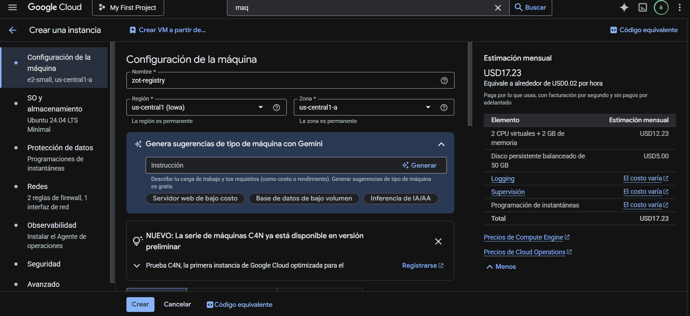
</div

---

<br />

<div align="center">
  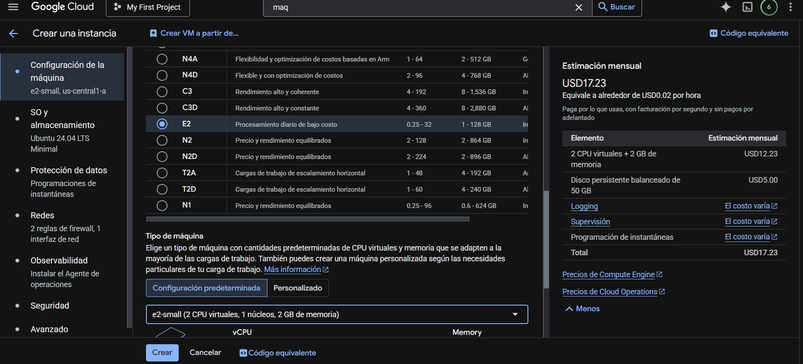
</div

---

<br />

<div align="center">
  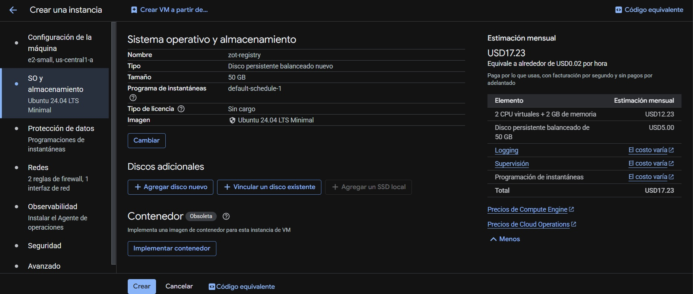
</div

---

En redes colocar marcar http, https y colocar la etíqueta zot que se configuró anteriormente para habilitar el puerto 5000

<div align="center">
  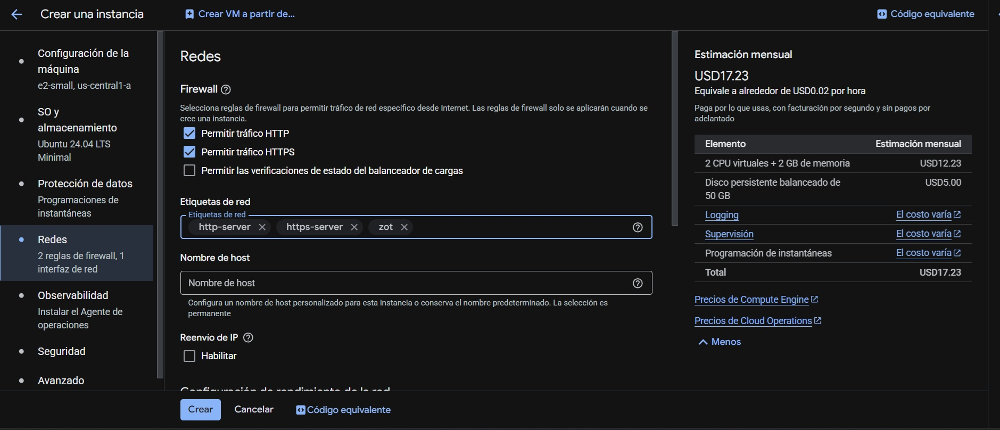
</div

---

## Instalar Docker en maquina virtual

Después de crear la maquína virtual, dar click en ssh y abrir la consola o conectarse desde la terminal de wsl que se configuró anteriormente:

```bash
gcloud compute ssh --zone "us-central1-a" "zot-registry" --project "project-52ffd0bf-b13b-4292-983"
```

Instala Docker desde los repositorios oficiales de Ubuntu.

```bash
sudo apt update && sudo apt upgrade -y
sudo apt install -y docker.io
```

## Agregar usuario al grupo Docker

Para poder ejecutar comandos Docker sin `sudo`, agregar el usuario actual al grupo `docker` y reiniciar la sesión.

```bash
sudo usermod -aG docker $USER
sudo reboot
```
Después del reinicio, volver a conectarte vía a la maquina virtual.


## Instalar y ejecutar Zot (Registro privado)

Zot será nuestro registro de imágenes privado. Lo ejecutaremos como un contenedor Docker.

```bash
sudo docker run -d -p 5000:5000 --name zot-registry ghcr.io/project-zot/zot-linux-amd64:latest
```
- `-d`: Modo "detached" (segundo plano).
- `-p 5000:5000`: Mapea el puerto 5000 del contenedor al puerto 5000 de la VM.
- `--name zot-registry`: Asigna un nombre al contenedor.

## Verificación de zot instalado

```bash
docker ps
curl http://localhost:5000/v2/_catalog
```

<div align="center">
  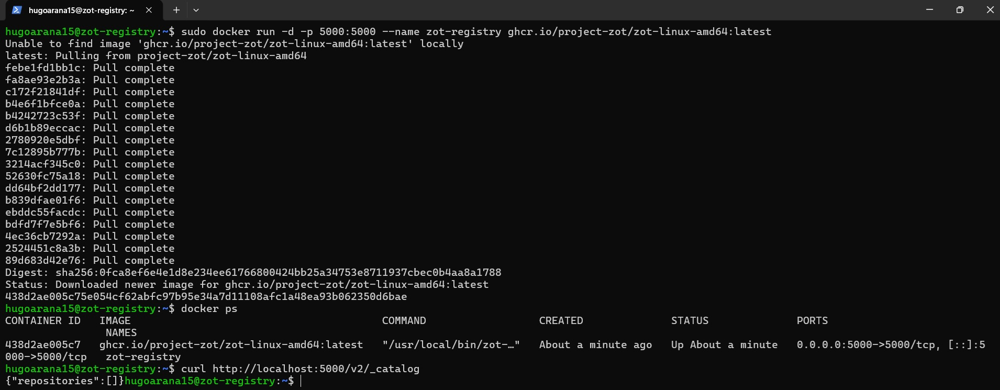
</div>

---

Verificamos que este corriendo en el navegador con la ip externa de la maquina virtual

```url
http://34.135.161.239:5000/home
```

<div align="center">
  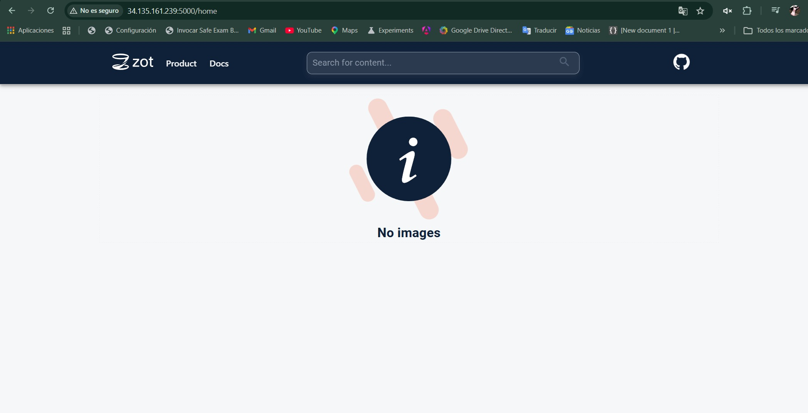
</div>

Al instalarlo se tiene:

- Zot corriendo en puerto 5000
- Sin HTTPS (HTTP plano)
- Sin persistencia (si el contenedor muere, se pierden las imágenes)
- Sin autenticación

---

## Registrarse en ngrok


```url
https://dashboard.ngrok.com/signup
```

<div align="center">
  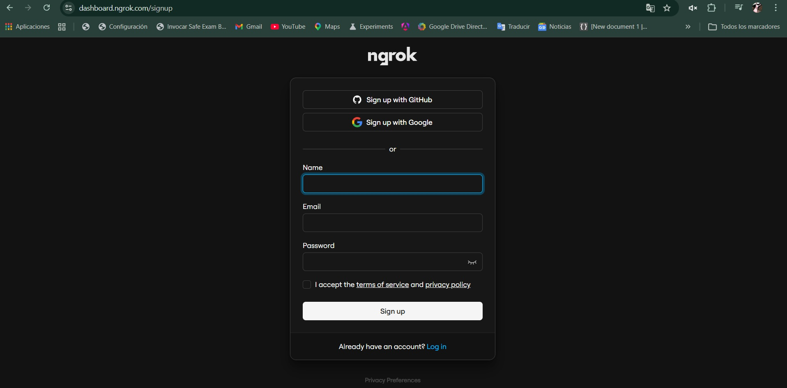
</div>

---

En setup e installation elegir linux.

<div align="center">
  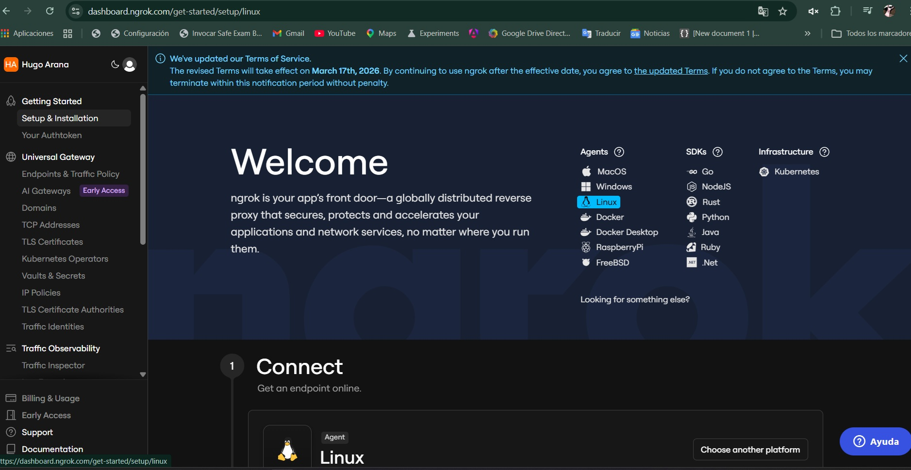
</div>

---

Copiar en la terminal de la maquina virtual el comando que esta más abajo.

<div align="center">
  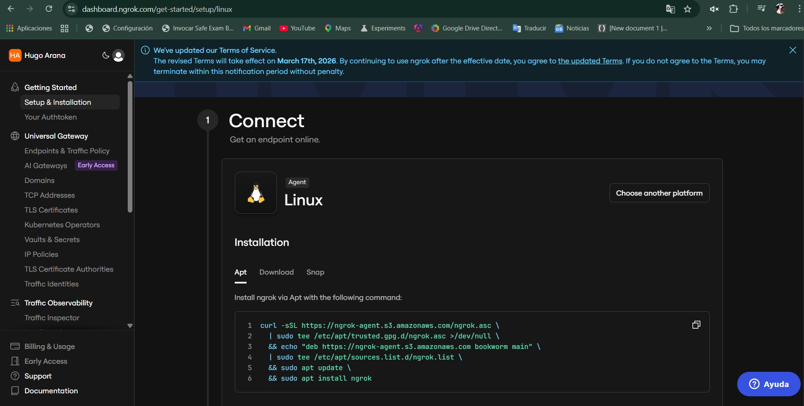
</div>

---

<br />

<div align="center">
  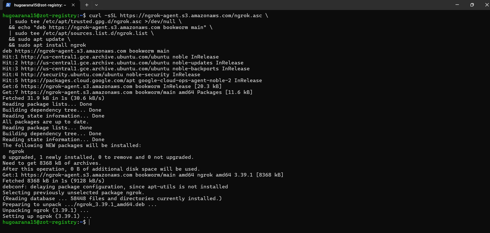
</div>

> Luego copiar el comando con el token en la terminal de maquina virtual, este código es personal y no se debe perder o compartir.

Ya por último ejecutar lo siguiente

```bash
ngrok http 5000
```

<div align="center">
  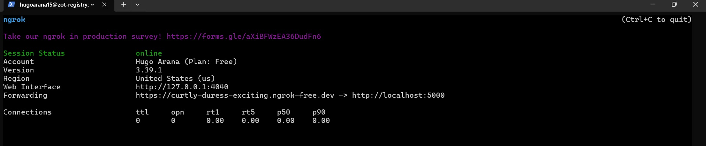
</div>

> El puerto debe ser 5000 ya que ese fue el que se configuro cuando se instaló zot.


---


## ngrok y zot en segundo plano

El problema es que para que ngrok funcione siempre tiene que correr en primer plano impidiendo realizar otras acciones en la maquina virtual, la solución es hacer lo siguiente:

1. Crear una red de Docker:

```bash
docker network create zot-net
```

2. Reiniciar el contenedor de Zot en esa red:

```bash
docker rm -f zot-registry
docker run -d -p 5000:5000 --name zot-registry --network zot-net ghcr.io/project-zot/zot-linux-amd64:latest
```

3. Finalmente, lanzar ngrok de fondo apuntando al nombre del contenedor:

```bash
docker run -d --net zot-net --name ngrok-agent \
  -e NGROK_AUTHTOKEN=TU_TOKEN_AQUI \
  ngrok/ngrok:latest http zot-registry

```
> NGROK_AUTHTOKEN es el token que da ngronk y se obtiene de la página: https://dashboard.ngrok.com/get-started/setup/linux en la parte que dice ngrok config add-authtoken

> Si se usa la versión gratuita de ngrok, la URL cambia cada vez que se reinicia el túnel.

## Contruir y subir imágenes locales a zot ngrok

Ejecutar el siguiente script:

```bash
cd 201504070_LAB_SO1_1S2026/Proyecto3/script
sudo chmod +x push-images.sh
cd ..
./script/push-images.sh
```
<div align="center">
  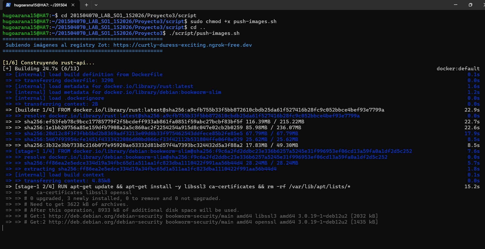
</div>

---

## Crear el cluster de kubernet

```bash
gcloud container clusters create mumnk8s-cluster  \
    --zone us-central1-a  \
    --num-nodes 2  \
    --machine-type e2-standard-4  \
    --gateway-api standard  \
    --disk-size 50  \
    --disk-type pd-standard
```
### Instalar y configurar dependencias necesarias

```bash
sudo apt-get install google-cloud-cli-gke-gcloud-auth-plugin
```
```bash
gcloud services enable container.googleapis.com compute.googleapis.com
```

```bash
sudo apt-get install kubectl
```

---

## Conectar kubectl al nuevo clúster

```bash
gcloud container clusters get-credentials mumnk8s-cluster --zone us-central1-a
```

<div align="center">
  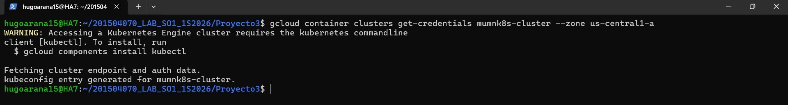
</div>

---

## Aplicar la parte 1 de los archivos yaml

Navegar hasta la carpeta:

```bash
cd 201504070_LAB_SO1_1S2026/Proyecto3/k8s/parte1
```

```bash
kubectl apply -f .
```

O aplicar de forma individualo loa archivo yaml.

```bash
kubectl apply -f 01-namespace.yaml
kubectl apply -f 02-deployment-rust.yaml
kubectl apply -f 03-service-rust.yaml
kubectl apply -f 04-gateway.yaml
kubectl apply -f 05-httproute.yaml
kubectl apply -f 06-hpa.yaml
```
<div align="center">
  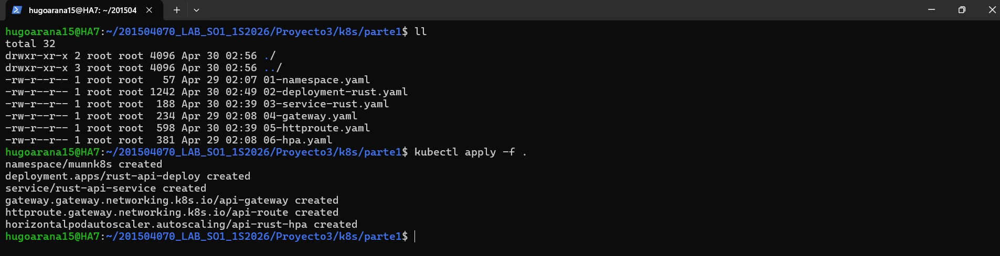
</div>

---

## Ver los pods creandose

```bash
kubectl get pods -n mumnk8s -w
```
## Obtener la ip pública

```bash
kubectl get gateway api-gateway -n mumnk8s -w
```

<div align="center">
  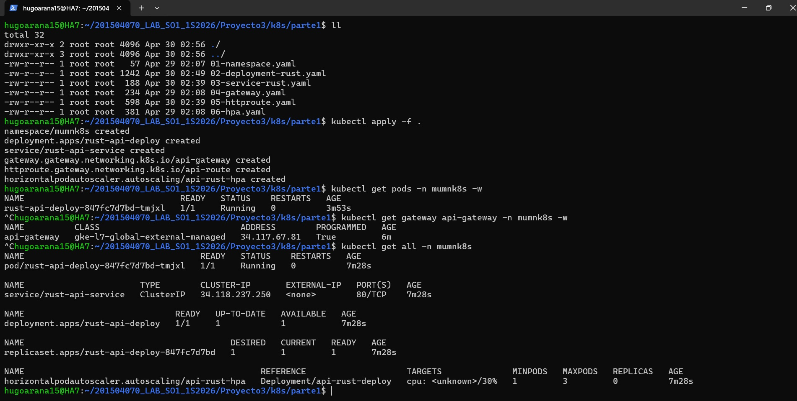
</div>

---

## Probar la aplicación

Las aplicaciones para kubernets siempre tienen que tener un endpoint "ip/" que devuelva Ok, por lo que se puede utilizar para comprobar que la aplicación esta funcionando.

```bash
Get http://34.117.67.81/
```

<div align="center">
  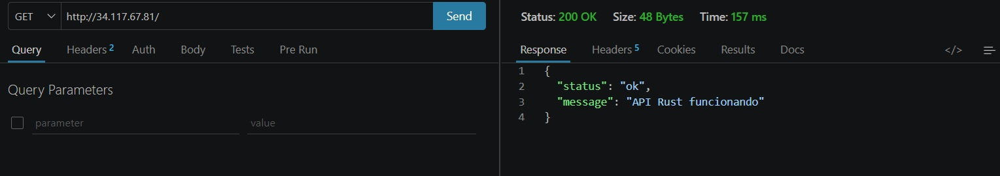
</div>

---


## Comandos útiles

### Volver a construir los pods

```bash
kubectl rollout status deployment rust-api-deploy -n mumnk8s
```

### Ver los logs de los pods por si fallan 
```bash
kubectl describe httproute api-route -n mumnk8s
```

---

## Diagnóstico de problemas con Gateway y Load Balancer

Se presenta un escenario donde el Pod se encuentra en estado `Running` y el Gateway ya posee una IP pública asignada, pero las solicitudes realizadas con `curl` fallan.

En este caso, se deben considerar dos factores principales:

### 1. Tiempo de propagación del Load Balancer

El Gateway en GKE depende de un Load Balancer externo que puede tardar algunos minutos en configurarse completamente.
Aunque el Gateway muestre el estado `Programmed: True`, esto no garantiza que el tráfico ya esté siendo enrutado correctamente.

---

### 2. Verificación del HTTPRoute

Es necesario inspeccionar la configuración del recurso `HTTPRoute`:

```bash
kubectl describe httproute api-route -n mumnk8s
```

Un problema común ocurre cuando los nombres no coinciden entre el `Service` y el `HTTPRoute`.
Por ejemplo, si el `HTTPRoute` apunta a:

```yaml
api-rust-service
```

pero el `Service` real se llama:

```yaml
rust-api-service
```

esto provocará que el Gateway no pueda enrutar correctamente las solicitudes.

Para validar los servicios disponibles:

```bash
kubectl get svc -n mumnk8s
```

También es recomendable verificar el estado del `HTTPRoute`:

```bash
kubectl get httproute -n mumnk8s
```

---

## Validación de la aplicación sin Gateway

Para confirmar que la aplicación funciona correctamente de forma interna, se puede realizar un `port-forward`:

```bash
kubectl port-forward pod/rust-api-deploy-847fc7d7bd-tmjxl 8080:8080 -n mumnk8s
```

En otra terminal:

```bash
curl http://localhost:8080/health
```

Si esta prueba responde correctamente, se concluye que la aplicación está funcionando y el problema se limita al enrutamiento del Gateway.

---

## Problema de "no healthy upstream"

Cuando se recibe el mensaje:

```text
no healthy upstream
```

esto indica que el Load Balancer de GCP no reconoce ningún backend como saludable.

### Causa principal

El Load Balancer realiza verificaciones de salud (health checks) automáticamente hacia la ruta raíz:

```http
GET /
```

Si la aplicación no tiene un endpoint que responda con código **200 OK** en `/`, el backend será marcado como no saludable.

Aunque exista un endpoint como:

```http
/health
```

este no será utilizado por defecto por el Load Balancer.

---

## Verificación del estado del Gateway

Para inspeccionar el estado del Gateway y sus condiciones:

```bash
kubectl describe gateway api-gateway -n mumnk8s | grep -A 20 "Status"
```

---

## Verificación de backends en GCP

Se puede comprobar si existen configuraciones adicionales como `BackendPolicy`:

```bash
kubectl get backendpolicy -n mumnk8s 2>/dev/null || echo "no backendpolicy"
```

Y listar los servicios backend del Load Balancer:

```bash
gcloud compute backend-services list --global
```

---

## Prueba detallada con curl

Para obtener más información sobre la respuesta del servidor:

```bash
curl -v http://34.117.67.81/health
```

---


