**UNIVERSIDAD DE SAN CARLOS DE GUATEMALA**   
**FACULTAD DE INGENIERÍA**  
**INGENIERÍA EN SISTEMAS**  
**SISTEMAS OPERATIVOS 1**  
**PRIMER SEMESTRE DE 2026**

| Registro académico: 201504070  | CUI: 3236666040511 |
| :---- | :---- |
| **Nombre:** Hugo Jorge Luis Perez Arana | **Proyecto:** 2 |
| **Aux:** Jose Daniel Lorenza Medina | **Sección:** P |

---

# Monitoreo de Unidades Militares en la Nube con Kubernete


Todas las configuraciones se harán atravez de wsl.

## 1. Copiar la carpeta del proyecto a la ruta:

```bash
\\wsl.localhost\Ubuntu\home\hugoarana15\201504070_LAB_SO1_1S2026\Proyecto3
```

## 2. Acceder a wsl en la consola y abrir el proyecto

```bash
wsl
cd ~
cd "ruta_del_proyecto"
code .
```

<div align="center">
  
</div>

## 3. Instalar docker y docker compose

### 1. Preparar el sistema

```bash
sudo apt update && sudo apt upgrade -y
sudo apt install ca-certificates curl gnupg lsb-release -y
```

### 2. Agregar la clave GPG oficial de Docker
Esto asegura que el software que descargues esté firmado correctamente:

```bash
sudo install -m 0755 -d /etc/apt/keyrings
curl -fsSL https://download.docker.com/linux/ubuntu/gpg | sudo gpg --dearmor -o /etc/apt/keyrings/docker.gpg
sudo chmod a+r /etc/apt/keyrings/docker.gpg
```

### 3. Configurar el repositorio
Ejecutar este comando para añadir el repositorio de Docker a las fuentes de `apt`:

```bash
echo \
  "deb [arch=$(dpkg --print-architecture) signed-by=/etc/apt/keyrings/docker.gpg] https://download.docker.com/linux/ubuntu \
  $(. /etc/os-release && echo "$VERSION_CODENAME") stable" | \
  sudo tee /etc/apt/sources.list.d/docker.list > /dev/null
```

### 4. Instalar Docker Engine y Docker Compose
Ahora instala el motor de Docker y el plugin de Compose (V2):

```bash
sudo apt update
sudo apt install docker-ce docker-ce-cli containerd.io docker-buildx-plugin docker-compose-plugin -y
```

---

### 5. Configuración Post-Instalación
Para evitar escribir `sudo` cada vez que se use un comando de Docker:

1.  **Crear el grupo docker:**
    ```bash
    sudo groupadd docker
    ```
2.  **Añadir tu usuario al grupo:**
    ```bash
    sudo usermod -aG docker $USER
    ```
3.  **Aplicar los cambios:** (o simplemente cerrar y abrir la terminal)
    ```bash
    newgrp docker
    ```

### 6. Iniciar el servicio en WSL
A diferencia de una instalación nativa en Linux, WSL no siempre inicia los servicios automáticamente. Ejecuta:
```bash
sudo service docker start
```

### 7. Verificar instalación

```bash
sudo service docker status
```

---

## Instalar gcloud en WSL

### 1. Instalar gcloud en WSL

```bash
sudo apt update
sudo apt install -y apt-transport-https ca-certificates gnupg curl

# Agregar repositorio oficial
echo "deb [signed-by=/usr/share/keyrings/cloud.google.gpg] https://packages.cloud.google.com/apt cloud-sdk main" | sudo tee /etc/apt/sources.list.d/google-cloud-sdk.list

# Importar clave
curl https://packages.cloud.google.com/apt/doc/apt-key.gpg | sudo gpg --dearmor -o /usr/share/keyrings/cloud.google.gpg

# Instalar
sudo apt update
sudo apt install -y google-cloud-sdk
```

---

## 🚀 2. Inicializar (login)

```bash
gcloud init
```

Esto:

* Abre un link en el navegador
* Hacer login con la cuenta de Google
* Elegir proyecto

<div align="center">
  
</div>

---

## 🔑 3. Login rápido (alternativa)

Si no quieres el asistente:

```bash
gcloud auth login
```

---

## 📌 4. Seleccionar proyecto

1. Elegir el proyecto configurado en google cloud.
2. Elegir la zona del proyecto en este caso se ha elegido: [9] us-central1-a


<div align="center">
  
</div>


Ver el actual:

```bash
gcloud config list
```

Si se quiere cambiar de proyecto:

```bash
gcloud config set project TU_PROJECT_ID
```

---

## 🧪 5. Probar que funciona

```bash
gcloud info
```

---

## 🐳 6. (IMPORTANTE para Docker/Zot)

Configurar acceso a registries:

```bash
gcloud auth configure-docker
```

👉 Esto permite hacer:

```bash
docker push
docker pull
```

a registries de Google (como Artifact Registry)

---

## 🧹 Si quieres resetear gcloud

```bash
rm -rf ~/.config/gcloud
```

---


## Configurar maquina virtual para zot

Primero habilitar puertos en Firewall > Políticas de firewall > Crear regla de firewall

<div align="center">
  
</div>

---

Colocar nombre, descripción y una etíqueta que posteriormente se usará en la creación de maquina virtual

<div align="center">
  
</div>

---

Colocar en puerto 5000 que es el que utilizará zot, en rango colocar TCP 0.0.0.0/0 que significa que se aceptara todo el tráfico por ese puerto.

<div align="center">
  
</div>
---

## Crear maquina virtual

En el buscador colocar "Instancias de VM" y crear nueva VM

Para este proyecto se ha elegído:

**Nombre:** zot-registry
**Región:** us-central1
**zona:** us-central1-a
**Tipo de maquina:** E2 (2 CPU virtuales, 1 Nucleo y 2 Gb de memoria Ram)
**Sistema operativo:** x86/x64 Ubuntu 24.04 LTS Minimal
**Tamaño de disco:** 50GB

<div align="center">
  
</div

---

<br />

<div align="center">
  
</div

---

<br />

<div align="center">
  
</div

---

En redes colocar marcar http, https y colocar la etíqueta zot que se configuró anteriormente para habilitar el puerto 5000

<div align="center">
  
</div

---

## Instalar Docker en maquina virtual

Después de crear la maquína virtual, dar click en ssh y abrir la consola o conectarse desde la terminal de wsl que se configuró anteriormente:

```bash
gcloud compute ssh --zone "us-central1-a" "zot-registry" --project "project-52ffd0bf-b13b-4292-983"
```

Instala Docker desde los repositorios oficiales de Ubuntu.

```bash
sudo apt update && sudo apt upgrade -y
sudo apt install -y docker.io
```

## Agregar usuario al grupo Docker

Para poder ejecutar comandos Docker sin `sudo`, agregar el usuario actual al grupo `docker` y reiniciar la sesión.

```bash
sudo usermod -aG docker $USER
sudo reboot
```
Después del reinicio, volver a conectarte vía a la maquina virtual.


## Instalar y ejecutar Zot (Registro privado)

Zot será nuestro registro de imágenes privado. Lo ejecutaremos como un contenedor Docker.

```bash
sudo docker run -d -p 5000:5000 --name zot-registry ghcr.io/project-zot/zot-linux-amd64:latest
```
- `-d`: Modo "detached" (segundo plano).
- `-p 5000:5000`: Mapea el puerto 5000 del contenedor al puerto 5000 de la VM.
- `--name zot-registry`: Asigna un nombre al contenedor.

## Verificación de zot instalado

```bash
docker ps
curl http://localhost:5000/v2/_catalog
```

<div align="center">
  
</div>

---

Verificamos que este corriendo en el navegador con la ip externa de la maquina virtual

```url
http://34.135.161.239:5000/home
```

<div align="center">
  
</div>

Al instalarlo se tiene:

- Zot corriendo en puerto 5000
- Sin HTTPS (HTTP plano)
- Sin persistencia (si el contenedor muere, se pierden las imágenes)
- Sin autenticación

---

## Registrarse en ngrok


```url
https://dashboard.ngrok.com/signup
```

<div align="center">
  
</div>

---

En setup e installation elegir linux.

<div align="center">
  
</div>

---

Copiar en la terminal de la maquina virtual el comando que esta más abajo.

<div align="center">
  
</div>

---

<br />

<div align="center">
  
</div>

> Luego copiar el comando con el token en la terminal de maquina virtual, este código es personal y no se debe perder o compartir.

Ya por último ejecutar lo siguiente

```bash
ngrok http 5000
```

<div align="center">
  
</div>

> El puerto debe ser 5000 ya que ese fue el que se configuro cuando se instaló zot.


---


## ngrok y zot en segundo plano

El problema es que para que ngrok funcione siempre tiene que correr en primer plano impidiendo realizar otras acciones en la maquina virtual, la solución es hacer lo siguiente:

1. Crear una red de Docker:

```bash
docker network create zot-net
```

2. Reiniciar el contenedor de Zot en esa red:

```bash
docker rm -f zot-registry
docker run -d -p 5000:5000 --name zot-registry --network zot-net ghcr.io/project-zot/zot-linux-amd64:latest
```

3. Finalmente, lanzar ngrok de fondo apuntando al nombre del contenedor:

```bash
docker run -d --net zot-net --name ngrok-agent \
  -e NGROK_AUTHTOKEN=TU_TOKEN_AQUI \
  ngrok/ngrok:latest http zot-registry

```
> NGROK_AUTHTOKEN es el token que da ngronk y se obtiene de la página: https://dashboard.ngrok.com/get-started/setup/linux en la parte que dice ngrok config add-authtoken

> Si se usa la versión gratuita de ngrok, la URL cambia cada vez que se reinicia el túnel.

## Contruir y subir imágenes locales a zot ngrok

Ejecutar el siguiente script:

```bash
cd 201504070_LAB_SO1_1S2026/Proyecto3/script
sudo chmod +x push-images.sh
cd ..
./script/push-images.sh
```
<div align="center">
  
</div>

---

## Crear el cluster de kubernet

```bash
gcloud container clusters create mumnk8s-cluster  \
    --zone us-central1-a  \
    --num-nodes 2  \
    --machine-type e2-standard-4  \
    --gateway-api standard  \
    --disk-size 50  \
    --disk-type pd-standard
```
### Instalar y configurar dependencias necesarias

```bash
sudo apt-get install google-cloud-cli-gke-gcloud-auth-plugin
```
```bash
gcloud services enable container.googleapis.com compute.googleapis.com
```

```bash
sudo apt-get install kubectl
```

---

## Conectar kubectl al nuevo clúster

```bash
gcloud container clusters get-credentials mumnk8s-cluster --zone us-central1-a
```

<div align="center">
  
</div>

---

## Aplicar la parte 1 de los archivos yaml

Navegar hasta la carpeta:

```bash
cd 201504070_LAB_SO1_1S2026/Proyecto3/k8s/parte1
```

```bash
kubectl apply -f .
```

O aplicar de forma individualo loa archivo yaml.

```bash
kubectl apply -f 01-namespace.yaml
kubectl apply -f 02-deployment-rust.yaml
kubectl apply -f 03-service-rust.yaml
kubectl apply -f 04-gateway.yaml
kubectl apply -f 05-httproute.yaml
kubectl apply -f 06-hpa.yaml
```
<div align="center">
  
</div>

---

## Ver los pods creandose

```bash
kubectl get pods -n mumnk8s -w
```
## Obtener la ip pública

```bash
kubectl get gateway api-gateway -n mumnk8s -w
```

<div align="center">
  
</div>

---

## Probar la aplicación

Las aplicaciones para kubernets siempre tienen que tener un endpoint "ip/" que devuelva Ok, por lo que se puede utilizar para comprobar que la aplicación esta funcionando.

```bash
Get http://34.117.67.81/
```

<div align="center">
  
</div>

---

## Levantar el go service

Ir a la carpeta:

```bash
cd 201504070_LAB_SO1_1S2026/Proyecto3/k8s/parte2
```

```bash
kubectl apply -f .
```

O aplicar de forma individualo loa archivo yaml.

```bash
kubectl apply -f 07-deployment-go.yaml
kubectl apply -f 08-service-go.yaml
```

<div align="center">
  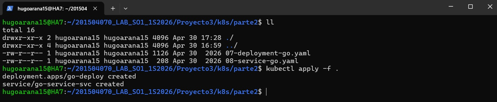
</div>

## Comandos útiles para ver el pod

### Ver pods

```bash
kubectl get pods -n mumnk8s
```

---

### Ver logs en tiempo real

```bash
kubectl logs -f rust-api-deploy-847fc7d7bd-tmjxl -n mumnk8s
```

---

### Describir el pod (MUY recomendado ahora)

```bash
kubectl describe pod rust-api-deploy-847fc7d7bd-tmjxl -n mumnk8s
```

> Como no se ha levantado grpc server saldra un error pero se soluciona al levantar los servicios que hacen falta

---

## Levantar grpc server y rabbitmq

Esto a diferencia de lo anterior se debe levantar manualmente

### 1. Primero RabbitMQ (grpc-server lo necesita)

```bash
kubectl apply -f 10-deployment-rabbitmq.yaml
kubectl apply -f 11-service-rabbitmq.yaml
```

### Espera que RabbitMQ esté Ready antes de continuar

```bash
kubectl get pods -n mumnk8s -w   # Ctrl+C cuando se vea 1/1 Running
```

### 2. Luego grpc-server

```bash
kubectl apply -f 12-deployment-grpc-server.yaml
kubectl apply -f 13-service-grpc-server.yaml
```

## kubectl rollout restart deployment/go-deploy -n mumnk8s

Después de levantar grpc-server el pod de go-service se leventará automáticamente solo hay que esperar alrededor de 7 minutos. Si el contenedor no se reinicía enteonces aplicar el comando:

```bash
kubectl rollout restart deployment/go-deploy -n mumnk8s
```
---

## Comandos útiles para ver los pods

### Ver pods

```bash
kubectl get pods -n mumnk8s
```

---

### Ver logs en tiempo real

```bash
kubectl logs -f rust-api-deploy-847fc7d7bd-tmjxl -n mumnk8s
```

---

### Describir el pod (MUY recomendado ahora)

```bash
kubectl describe pod rust-api-deploy-847fc7d7bd-tmjxl -n mumnk8s
```

<div align="center">
  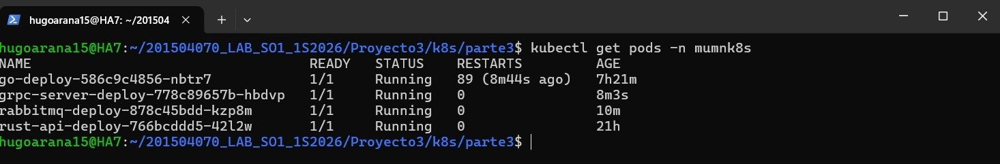
</div>

---

## Levantar el consumer

El consumer necesita tanto RabbitMQ como Valkey para arrancar — si Valkey no existe crasheará igual que el go-service, en kubernets entrará en CrashLoopBackOff hasta que Valkey esté levantado.

```bash
cd 201504070_LAB_SO1_1S2026/Proyecto3/k8s/parte4
```

```bash
kubectl apply -f 14-deployment-consumer.yaml  # crasheará hasta tener Valkey
```

### Ver pods

```bash
kubectl get pods -n mumnk8s
```

---

### Ver logs en tiempo real

```bash
kubectl logs -f consumer-deploy-dc699b746-l8vhs -n mumnk8s
```

---

### Describir el pod (MUY recomendado ahora)

```bash
kubectl describe pod consumer-deploy-dc699b746-l8vhs -n mumnk8s
```

---

## Levantar valkey en una maquina virtual

**Requisitos previos:**
- Cluster GKE creado con suficientes recursos
- KubeVirt instalado y todos los pods en `Running`
- `virtctl` instalado***

---

### Instalar KubeVirt

```bash
# Instalar el operador
kubectl apply -f https://github.com/kubevirt/kubevirt/releases/download/v1.7.2/kubevirt-operator.yaml

# Parchear para GKE (quita restricciones de nodos maestros)
kubectl patch deployment virt-operator -n kubevirt --type="json" \
  -p='[{"op": "remove", "path": "/spec/template/spec/affinity"}, {"op": "remove", "path": "/spec/template/spec/tolerations"}]'

# Instalar KubeVirt con emulación por software (necesario en GKE)

# Estar en la ruta 

cd 201504070_LAB_SO1_1S2026/Proyecto3/k8s/parte5

kubectl apply -f 15-emul-kubevirt.yaml 

# Esperar que todos los pods estén Running
kubectl get pods -n kubevirt -w
```

<div align="center">
  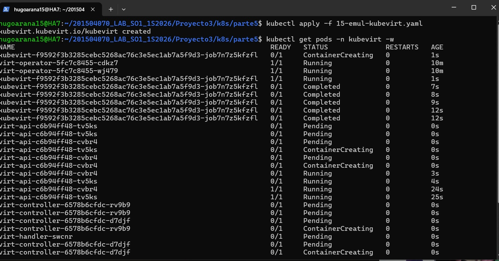
</div>

---

### Instalar virtctl 

> si ya se tiene instalado dará error, para arreglarlo solo se debe borrar virtctl y volver a instalarlo

sudo rm /usr/local/bin/virtctl

```bash
VERSION=$(kubectl get kubevirt.kubevirt.io/kubevirt -n kubevirt -o=jsonpath="{.status.observedKubeVirtVersion}")
ARCH=$(uname -s | tr A-Z a-z)-$(uname -m | sed 's/x86_64/amd64/')
curl -L -o virtctl https://github.com/kubevirt/kubevirt/releases/download/${VERSION}/virtctl-${VERSION}-${ARCH}
chmod +x virtctl
sudo mv virtctl /usr/local/bin/
```

<div align="center">
  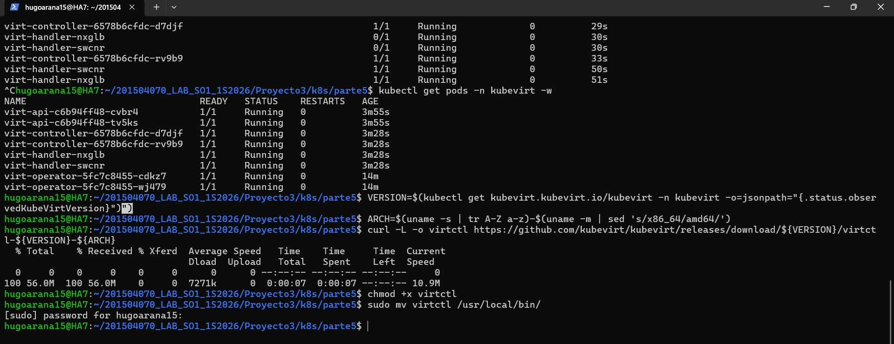
</div>

---

### Crear la VM Alpine para Valkey

```bash
# Estar en la ruta
cd 201504070_LAB_SO1_1S2026/Proyecto3/k8s/parte5
kubectl apply -f 16-valkey-vm.yaml
```

Monitorear hasta que esté `Running`:
```bash
kubectl get vmi valkey-vm -n mumnk8s -w
```

### Service ClusterIP para Valkey

> A diferencia de Grafana que usa NodePort (acceso externo),
> Valkey solo necesita ClusterIP porque solo lo acceden pods y VMs internamente.

**valkey-vm-svc.yaml** (kubectl apply -f)

```bash
# Estar en la ruta
cd 201504070_LAB_SO1_1S2026/Proyecto3/k8s/parte5
kubectl apply -f 17-valkey-vm-svc.yaml
```

---

### Entrar a la VM e instalar Valkey

```bash
virtctl console valkey-vm -n mumnk8s
# usuario: root (sin contraseña)
```
---

### Configuración inicial dentro de la VM

```sh
# 1. Levantar red (necesario en cada reinicio)
ip link set eth0 up && udhcpc -i eth0

# 2. Levantar loopback (necesario para valkey-cli)
ip link set lo up
```

---

### Preparar disco adicional (solo la primera vez)

```sh
mkdosfs -F 32 /dev/vdb
mkdir -p /mnt/data
mount /dev/vdb /mnt/data
```

---

### Instalar y compilar Valkey desde código fuente

```sh

set -e

# Dependencias necesarias
apk add --no-cache build-base git linux-headers tar curl

# Descargar código fuente
cd /tmp
curl -L https://github.com/valkey-io/valkey/archive/refs/tags/9.0.3.tar.gz -o valkey.tar.gz
tar -xzf valkey.tar.gz
cd valkey-9.0.3

# Verificar ubicación
ls
```

---

### Compilación

```sh
# Compilación compatible con Alpine antiguo y CPU emulada
make MALLOC=libc BUILD_TLS=no
```

> ⏱️ Este proceso puede tardar bastante (hasta ~1 hora en entornos emulados).
> No interrumpir mientras aparezcan líneas con `CC`.

---

### Instalación de binarios

```sh
install -m 755 src/valkey-server /usr/local/bin/valkey-server
install -m 755 src/valkey-cli /usr/local/bin/valkey-cli
```
Si lo anterior da error entonces copiar manualmente (SOLO SI LO ANTERIOR FALLA):

```sh
cp src/valkey-server /usr/local/bin/
cp src/valkey-cli /usr/local/bin/
chmod +x /usr/local/bin/valkey-*
```

---

### Ejecución de Valkey

```sh
valkey-server \
  --bind 0.0.0.0 \
  --port 6379 \
  --dir /mnt/data \
  --save "" \
  --protected-mode no \
  --daemonize yes
```

---

### Verificación

```sh
# Verificar puerto
netstat -tlnp | grep 6379

# Probar conexión
valkey-cli ping
```

Resultado esperado:

```text
PONG
```

---

## ⚠️ Importante (persistencia tras reinicio)

Cada vez que la VM reinicia, se debe levantar la interfaz loopback:

```sh
ip link set lo up
```

---

### Automatizar loopback (opcional)

```sh
echo "ip link set lo up" >> /etc/local.d/network.start
chmod +x /etc/local.d/network.start
rc-update add local
```

### 🧠 Mejora importante que recomendada agregar

Esto evita warnings y problemas futuros:

```sh
sysctl -w vm.overcommit_memory=1
```

### Para salir

Salir de la consola: `Ctrl + ]`

---

<div align="center">
  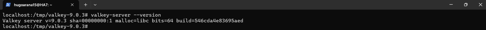
</div>

<br />

---

<div align="center">
  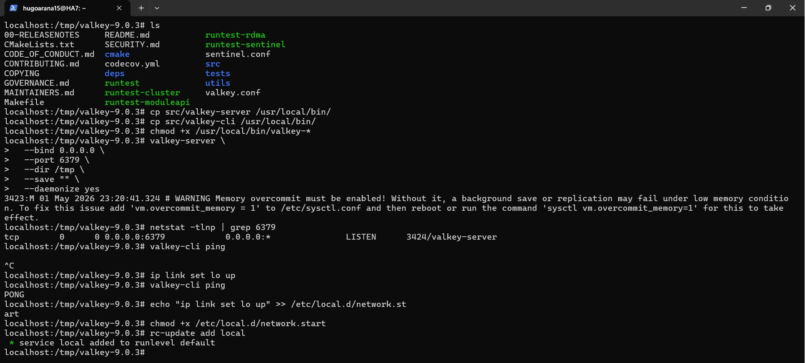
</div>

---

## Forzar a reiniciar a consumer

```sh
kubectl rollout restart deployment/consumer-deploy -n mumnk8s
```

Verificar que todos los pods están Running

```sh
kubectl get pods -n mumnk8s
```

<div align="center">
  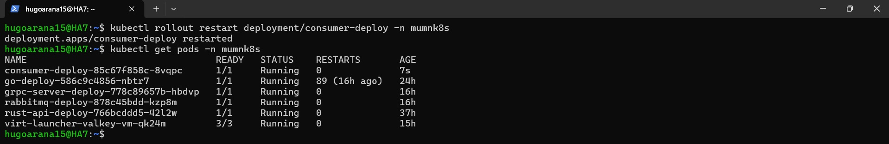
</div>

---

## Comandos para verificar logs e ingreso de datos en valkey

### 1. Ver si rust-api recibió la petición
```sh
kubectl logs -n mumnk8s deployment/rust-api-deploy
```

### 2. Ver si go-service recibió de rust y mandó por gRPC
```sh
kubectl logs -n mumnk8s deployment/go-deploy
```

### 3. Ver si grpc-server recibió y publicó a RabbitMQ
```sh
kubectl logs -n mumnk8s deployment/grpc-server-deploy
```

### 4. Ver si consumer está leyendo de RabbitMQ
```sh
kubectl logs -n mumnk8s deployment/consumer-deploy
```

### 5. Ver datos ingresados en valkey

```sh
kubectl run test-valkey --rm -it \
  --image=redis:7 \
  -n mumnk8s \
  -- redis-cli -h valkey-vm-svc.mumnk8s.svc.cluster.local -p 6379
```
> Mantener presionado enter hasta que salga: valkey-vm-svc.mumnk8s.svc.cluster.local:6379>

Ver todas las keys almacenadas
```sh
KEYS *
```

Ver cuántas keys hay en total
```sh
DBSIZE
```

<div align="center">
  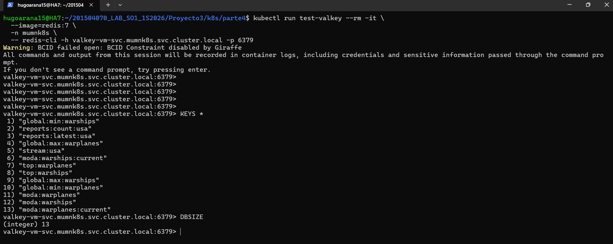
</div>

---

## Instalar grafana

### Ir a la ruta:

```sh
cd "201504070_LAB_SO1_1S2026/Proyecto3/k8s/parte6"
```

### Crear maquina virtual para grafana

```sh
kubectl apply -f 18-grafana-vm.yaml
```

### Exponer Grafana con NodePort

```sh
kubectl apply -f 19-grafana-vm-svc.yaml
```

### Entrar a la maquina virtual de grafana

```sh
virtctl console grafana-vm -n mumnk8s
# usuario: root (sin contraseña)
```
### Levantar red (necesario cada vez que reinicia la VM)

```sh
ip link set eth0 up && udhcpc -i eth0
```

### Formatear el disco extra de 5GB (solo la primera vez)

```sh
mkdosfs -F 32 /dev/vdb
mkdir -p /mnt/data
mount /dev/vdb /mnt/data
```

### Descargar Grafana al disco extra

```sh
wget https://dl.grafana.com/oss/release/grafana-11.5.0.linux-amd64.tar.gz -O /mnt/data/grafana.tar.gz
```

### Extraer
```sh
tar -zxvf /mnt/data/grafana.tar.gz -C /mnt/data/
```

### Crear directorios de datos

```sh
mkdir -p /mnt/data/grafana-data /mnt/data/grafana-logs /mnt/data/grafana-plugins
```

### Arrancar Grafana
```sh
/mnt/data/grafana-v11.5.0/bin/grafana-server \
  --homepath /mnt/data/grafana-v11.5.0 \
  cfg:default.paths.data=/mnt/data/grafana-data \
  cfg:default.paths.logs=/mnt/data/grafana-logs \
  cfg:default.paths.plugins=/mnt/data/grafana-plugins &
```

> Mostrará el output de ejecución después solo precionar enter


### Verificar que corre en el puerto 3000

```sh
netstat -tlnp | grep 3000
```

Salir de la consola: `Ctrl + ]`

---

<div align="center">
  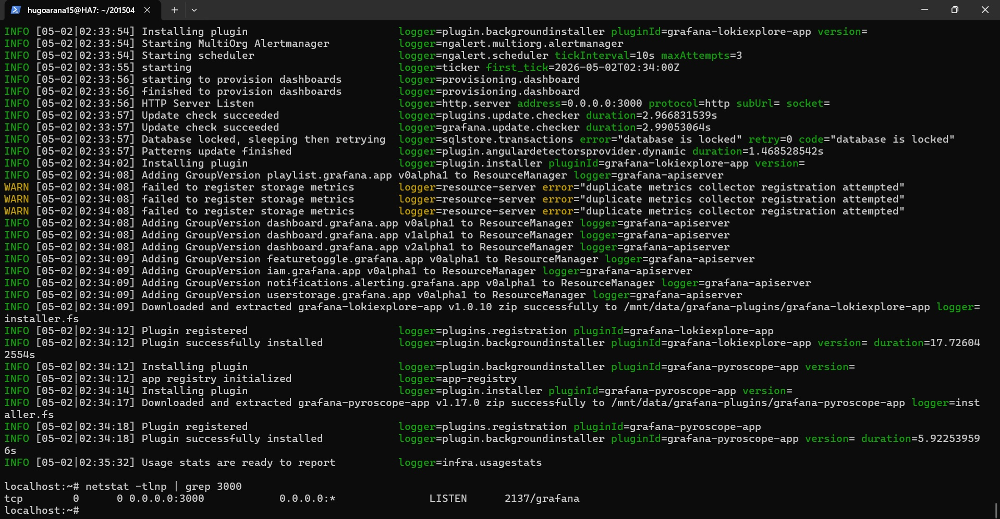
</div>

---

> **Nota:** El disco `/dev/vdb` (FAT32) y la red se pierden al reiniciar la VM. Ejecutar los pasos 1 y 2 del mount + red cada vez que reinicies, y el paso 6 para volver a arrancar Grafana.

---

### Verificar los endpoints de grafana

```bash
kubectl describe svc grafana-vm-svc -n mumnk8s | grep Endpoints
# Debe mostrar: Endpoints: <IP>:3000
```

---

### Abrir el firewall en GCP

```bash
gcloud compute firewall-rules create grafana-nodeport \
  --allow tcp:32000 \
  --source-ranges 0.0.0.0/0 \
  --description "Grafana NodePort"
```

---

<div align="center">
  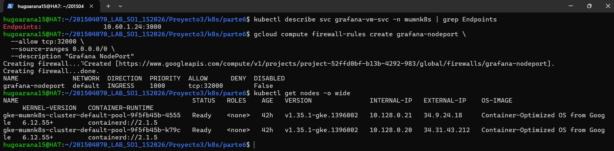
</div>

---

### Acceder a Grafana

Obténer la IP externa de cualquier nodo:
```bash
kubectl get nodes -o wide
# Columna EXTERNAL-IP
```

Abrir en el navegador:

```text
http://<EXTERNAL-IP>:32000
ejp:
http://34.9.24.18:32000/
```

<div align="center">
  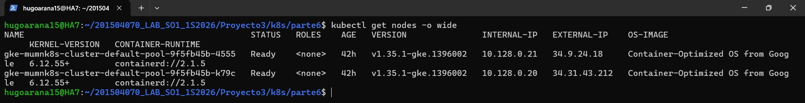
</div>

> El cluster tiene 2 nodos (2 máquinas virtuales en GCP). Ambas IPs son válidas para acceder a Grafana con NodePort — Kubernetes enruta el tráfico correctamente desde  cualquiera de los dos nodos.

---

## Configurar grafana

### Logearse en grafana con

```text
Usuario: admin
Password: admin
```

> Grafana pedirá cambiar la contraseña por default

### Añadir el datasource

En el home de grafana ir a Connections > Add new connection y en el buscador ingresar "redis", dar en instalar y luego en Add new data source.

<div align="center">
  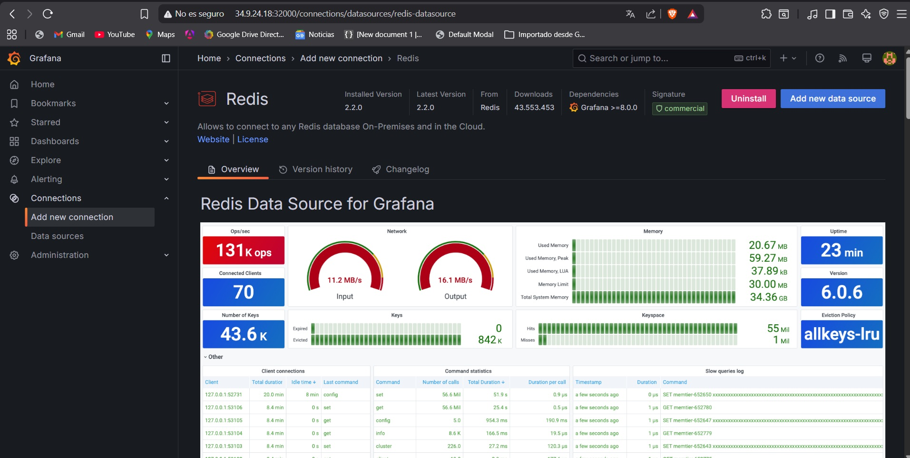
</div>

---

Luego en configuración de datasource colocar:

```text
Type: Standalon
Adress: redis://valkey-vm-svc.mumnk8s.svc.cluster.local:6379
```

Dar click en save y test

<div align="center">
  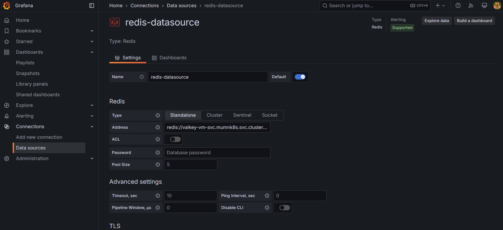
</div>

---

### Añadir dashboard

Ir a Dahboards > New dashboard

<div align="center">
  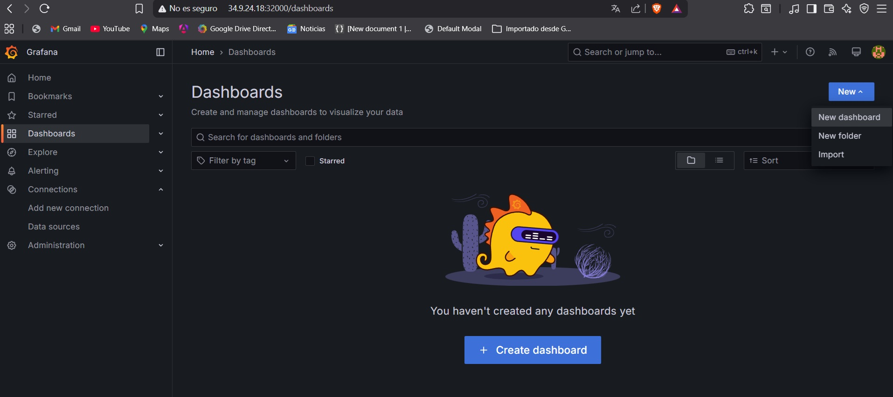
</div>

### Importar el dashboard

Importar el archivo json que esta en el proyecto en la ruta: 201504070_LAB_SO1_1S2026 > grafana > provisioning > dashboards > sopes-dashboard.json

<div align="center">
  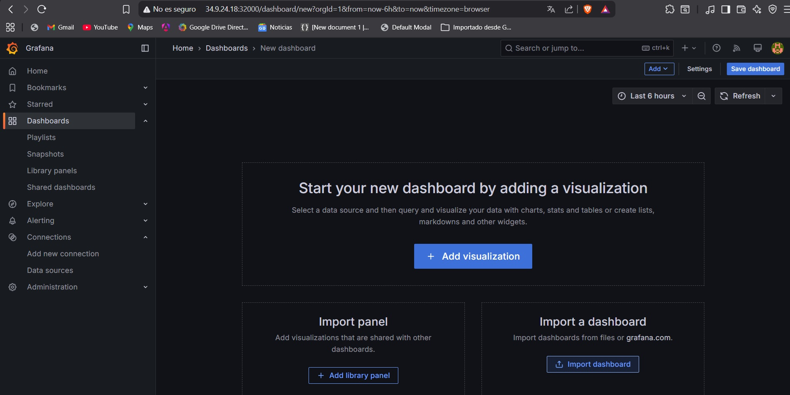
</div>

---
<br />

<div align="center">
  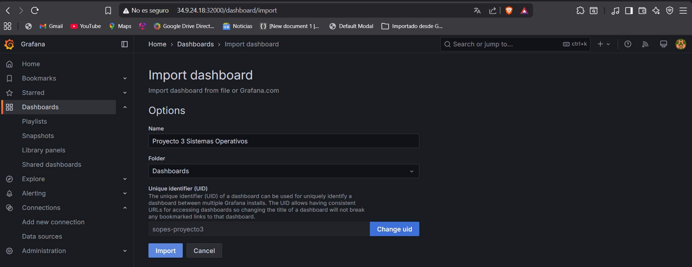
</div>

---

### Configurar nuevo datasource en las gráficas

- El json viene con el id del datasource de una instalación antigua por lo que se debe de cambiar.

- En cada una de las graficas hacer click en los 3 puntos y luego en editar.

<div align="center">
  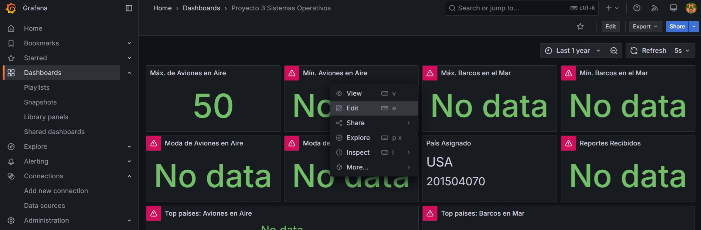
</div>

---

- Simplemente al dar click en el label de datasource y elegir redis-datasource el id del datasource se actualizará por el nuevo.

<div align="center">
  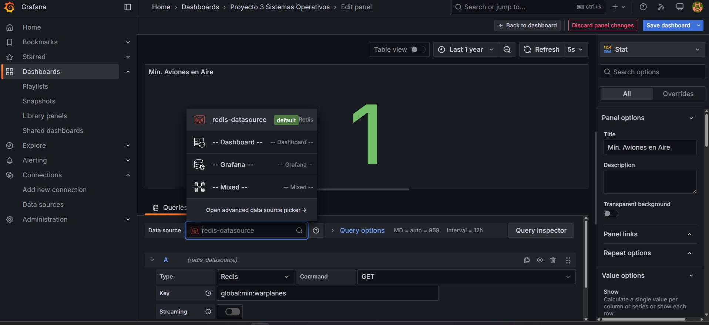
</div>

---

> Hacer lo mismo para todas las gráficas

<div align="center">
  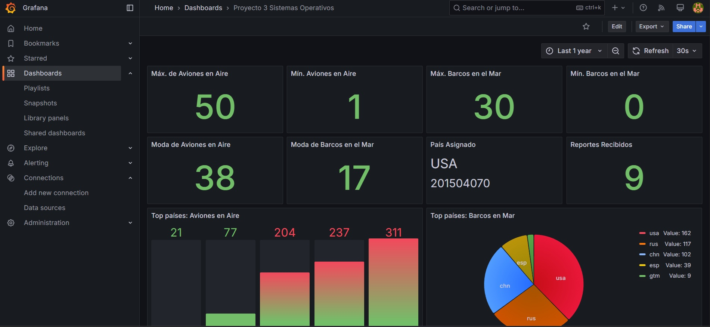
</div>

---