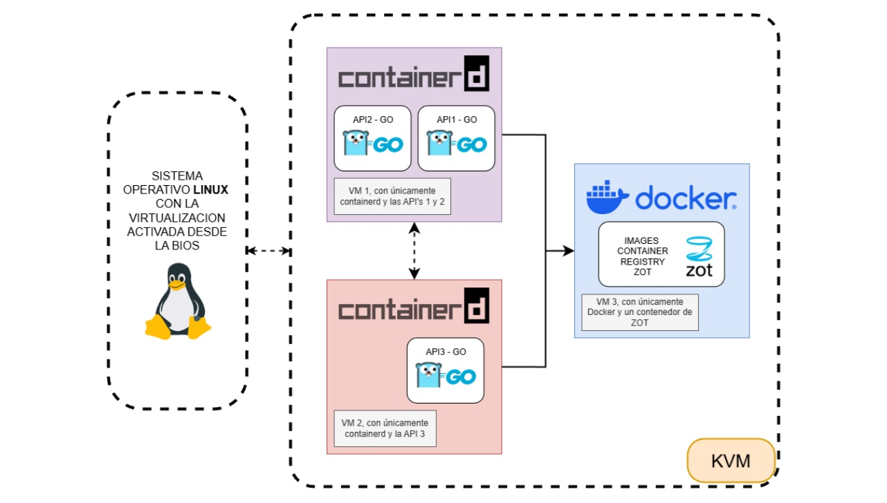

<div align="center">

# Laboratorio de Sistemas Operativos 1

**Universidad de San Carlos de Guatemala** · Facultad de Ingeniería · Ingeniería en Sistemas
Primer Semestre de 2026 · Sección P


</div>

| | |
| :-- | :-- |
| **Estudiante** | Hugo Jorge Luis Pérez Arana |
| **Registro académico** | 201504070 |
| **Auxiliar** | José Daniel Lorenza Medina |

---

## Descripción

Este repositorio reúne los proyectos del laboratorio de **Sistemas Operativos 1**. Ambos trabajan con contenedores y microservicios, y suben de nivel de forma progresiva: del despliegue manual en máquinas virtuales con KVM al despliegue automatizado en un clúster de Kubernetes en la nube.

## Contenido

| Proyecto | Tema | Tecnologías | Documentación |
| :-- | :-- | :-- | :-- |
| **[Proyecto 1](Proyecto1/)** | Desarrollo, conexión y gestión de contenedores en entornos virtualizados | KVM, Go, Docker, Containerd, Zot | [README](Proyecto1/README.md) · [Documentación](Proyecto1/documentacion/) |
| **[Proyecto 3](Proyecto3/)** | M.U.M.N.K8s: monitoreo de unidades militares en la nube con Kubernetes | GKE, Rust, Go, gRPC, RabbitMQ, Valkey, KubeVirt, Grafana, Locust | [README](Proyecto3/README.md) · [Guías](Proyecto3/doc/) |

Los enunciados originales están en PDF: [Proyecto 1](Proyecto1/documentacion/Proyecto1-SOPES1.pdf) y [Proyecto 3](Proyecto3/doc/Proyecto3-M.U.M.N.K8s-SO1.pdf).

---

## Proyecto 1 · Contenedores en entornos virtualizados

Arquitectura distribuida de **tres máquinas virtuales** sobre KVM, conectadas en una red privada (`192.168.122.0/24`) con IPs estáticas.

| VM | Rol | Componentes | IP |
| :-- | :-- | :-- | :-- |
| **VM1** | Nodo de ejecución | Containerd, API 1 y API 2 | `192.168.122.101` |
| **VM2** | Nodo de ejecución | Containerd, API 3 | `192.168.122.102` |
| **VM3** | Nodo de gestión | Docker y registro privado Zot (puerto 5000) | `192.168.122.103` |

**Flujo:** Docker construye las imágenes en VM3, Zot las almacena y Containerd las descarga y ejecuta en VM1 y VM2.

<div align="center">
  
</div>

**Las tres APIs** están escritas en Go, cada una con su `Dockerfile`, y se llaman entre sí. Todas exponen `GET /health`, que responde con el estado, la VM donde corre y el carnet. Además, cada API consulta a las otras dos mediante los endpoints `/apiN/201504070/call-apiM`.

| API | Puerto | Endpoints de comunicación |
| :-- | :-- | :-- |
| API 1 | 8080 | `/api1/201504070/call-api2` · `/api1/201504070/call-api3` |
| API 2 | 8081 | `/api2/201504070/call-api1` · `/api2/201504070/call-api3` |
| API 3 | 8080 | `/api3/201504070/call-api1` · `/api3/201504070/call-api2` |

**Documentación detallada** (en [`Proyecto1/documentacion/`](Proyecto1/documentacion/)):

- [Manual de instalación](Proyecto1/documentacion/Manual%20de%20instalaci%C3%B3n.md): KVM, creación de las VMs, red estática, Docker, Zot y Containerd, paso a paso.
- [Manual técnico](Proyecto1/documentacion/Manual%20T%C3%A9cnico.md): arquitectura, componentes y solución de problemas.
- [Explicación de la práctica](Proyecto1/documentacion/Explicaci%C3%B3n%20de%20la%20pr%C3%A1ctica.md): diferencias entre Docker y Containerd, y el flujo completo.
- [Pruebas de funcionalidad](Proyecto1/documentacion/Pruebas%20de%20funcionalidad.md): evidencias de los endpoints.

---

## Proyecto 3 · M.U.M.N.K8s

Sistema que recibe reportes de unidades militares (aviones en el aire y barcos en el mar por país), los procesa a través de una cadena de microservicios y los visualiza en Grafana. Corre sobre **Google Kubernetes Engine** (clúster `mumnk8s-cluster`, namespace `mumnk8s`).

```
Locust ──► Gateway API (GCP) ──► rust-api ──► go-service ──gRPC──► grpc-server
                                                                        │
Grafana ◄── Valkey (VM en KubeVirt) ◄── consumer ◄── RabbitMQ ◄────────┘
```

| Componente | Tecnología | Función |
| :-- | :-- | :-- |
| `rust-api` | Rust (actix-web) | Entrada pública. Recibe `POST /grpc-201504070` y reenvía a Go. |
| `go-service` | Go | Recibe el reporte en `/report` y lo envía por gRPC. |
| `grpc-server` | Go + gRPC | Publica cada reporte en la cola `war_reports` de RabbitMQ. |
| `rabbitmq` | RabbitMQ | Cola de mensajes entre el servidor gRPC y el consumidor. |
| `consumer` | Go | Lee la cola y guarda las métricas en Valkey. |
| `valkey` | Valkey en VM Alpine (KubeVirt) | Almacena conteos, últimos reportes, máximos, mínimos, modas y rankings. |
| `grafana` | Grafana en VM Alpine (KubeVirt) | Dashboard con datasource Redis/Valkey. |
| `locust` | Python | Generador de carga que simula los reportes. |

**Formato del reporte** (definido en [`war_report.proto`](Proyecto3/grpc-server/proto/war_report.proto)):

```json
{
  "country": "USA",
  "warplanes_in_air": 25,
  "warships_in_water": 10,
  "timestamp": "2026-03-12T20:15:30Z"
}
```

Países admitidos: `usa`, `rus`, `chn`, `esp` y `gtm`.

**Aspectos destacados**

- **Gateway API** nativo de GCP con `HTTPRoute` para exponer la API de Rust.
- **HPA** (autoescalado por CPU) en `rust-api` (1 a 3 réplicas) y en `go-service`.
- Imágenes publicadas en un registro **Zot** expuesto con **ngrok**.
- **KubeVirt** para correr Valkey y Grafana en máquinas virtuales dentro del clúster.
- Dashboard de Grafana provisionado automáticamente, con máximos, mínimos, moda, top de países y evolución temporal.

**Manifiestos de Kubernetes** (en [`Proyecto3/k8s/`](Proyecto3/k8s/)), organizados por parte:

| Carpeta | Contenido |
| :-- | :-- |
| `parte1` | Namespace, deployment y servicio de Rust, Gateway, HTTPRoute y HPA |
| `parte2` | Deployment, servicio y HPA del servicio Go |
| `parte3` | RabbitMQ y servidor gRPC |
| `parte4` | Consumer |
| `parte5` | Valkey en VM con KubeVirt |
| `parte6` | Grafana en VM con KubeVirt |

**Documentación**

- [README del Proyecto 3](Proyecto3/README.md): guía completa de instalación y despliegue (WSL, Docker, gcloud, Zot, ngrok, GKE, KubeVirt, Grafana y Locust).
- [Guía del ejemplo 1](Proyecto3/doc/Guia-demo1.md): API en Rust con Gateway API y HPA.
- [Guía de KubeVirt](Proyecto3/doc/guia-kubevirt.md): KubeVirt y Grafana sobre Alpine.

---

## Estructura del repositorio

```
.
├── Proyecto1/
│   ├── api1/ api2/ api3/        APIs en Go (main.go, Dockerfile, go.mod)
│   ├── documentacion/           manuales, pruebas, imágenes y enunciado PDF
│   └── README.md
└── Proyecto3/
    ├── rust-api/                API de entrada (Rust)
    ├── go-service/              servicio intermedio (Go)
    ├── grpc-server/             servidor gRPC → RabbitMQ (Go)
    ├── consumer/                consumidor RabbitMQ → Valkey (Go)
    ├── rabbitmq/ valkey-image/  imágenes personalizadas
    ├── grafana/                 imagen y provisioning del dashboard
    ├── k8s/                     manifiestos por partes (parte1 a parte6)
    ├── Locus/ test/             pruebas de carga con Locust
    ├── script/                  scripts para subir las imágenes
    ├── doc/                     guías y enunciado PDF
    ├── img/                     capturas de la documentación
    ├── docker-compose.yml       entorno local completo
    └── README.md
```

## Cómo empezar

**Clonar el repositorio**

```bash
git clone https://github.com/hugoarana89/201504070_LAB_SO1_1S2026.git
cd 201504070_LAB_SO1_1S2026
```

**Proyecto 1:** sigue el [Manual de instalación](Proyecto1/documentacion/Manual%20de%20instalaci%C3%B3n.md) para crear las tres VMs y luego construye y sube las imágenes desde VM3 (el [README del Proyecto 1](Proyecto1/README.md) tiene los comandos).

**Proyecto 3, entorno local** con Docker Compose:

```bash
cd Proyecto3
docker compose up --build
```

Esto levanta todos los servicios y expone la API de Rust en el puerto `8080`, RabbitMQ en `15672` (panel de administración) y Grafana en `3000`.

**Proyecto 3, despliegue en la nube:** sigue el [README del Proyecto 3](Proyecto3/README.md).

**Prueba de carga con Locust**

```bash
cd Proyecto3/Locus
pip install locust
locust -f locustfile.py
```

Después abre `http://localhost:8089` y apunta Locust a la IP pública de la API.

## Requisitos

| Proyecto | Necesita |
| :-- | :-- |
| Proyecto 1 | Linux con KVM, `virt-manager` y `libvirt`, Docker (VM3), Containerd (VM1 y VM2) y Go 1.21+ |
| Proyecto 3 | Docker y Docker Compose, `gcloud` y `kubectl`, una cuenta de Google Cloud con GKE, Python con Locust, y WSL si se trabaja desde Windows |
